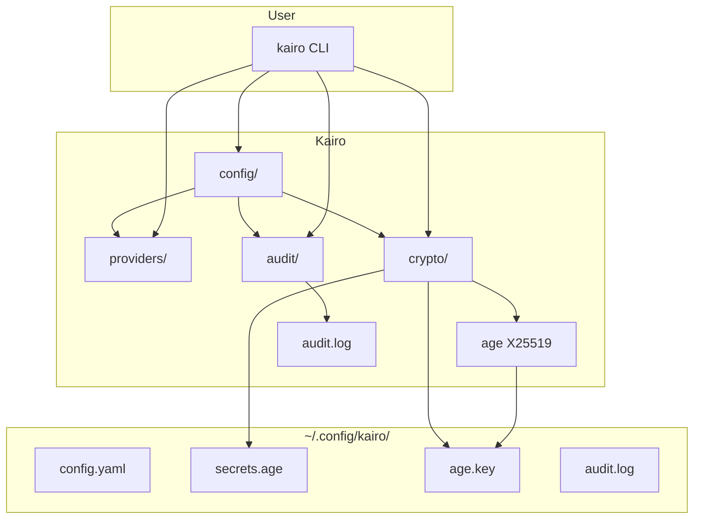

# Kairo

```text
 █████                 ███
░░███                 ░░░
 ░███ █████  ██████   ████  ████████   ██████
 ░███░░███  ░░░░░███ ░░███ ░░███░░███ ███░░███
 ░██████░    ███████  ░███  ░███ ░░░ ░███ ░███
 ░███░░███  ███░░███  ░███  ░███     ░███ ░███
 ████ █████░░████████ █████ █████    ░░██████
░░░░░ ░░░░░  ░░░░░░░░ ░░░░░ ░░░░░     ░░░░░░
```

[](https://github.com/dkmnx/kairo/releases)
[](https://go.dev/dl/)
[](https://github.com/dkmnx/kairo/actions)
[](LICENSE)

**Secure CLI for managing Claude Code API providers** with age (X25519) encryption, multi-provider support, and audit logging.

## Prerequisites

### Required: Claude Code CLI

Kairo acts as a wrapper around Claude Code CLI to enable multi-provider support. You need to install Claude Code first.

**Install Claude Code:**

- Visit: <https://claude.com/product/claude-code>
- Or via package managers:

  ```bash
  # Homebrew (macOS)
  brew install --cask claude-code

  # npm
  npm install -g @anthropic-ai/claude-code
  ```

**Verify installation:**

```bash
claude --version
```

## Quick Start

### Install

| Platform      | Command                                                                                   |
| ------------- | ----------------------------------------------------------------------------------------- |
| Linux/macOS   | `curl -sSL <https://raw.githubusercontent.com/dkmnx/kairo/main/scripts/install.sh> \| sh` |
| Windows       | `irm <https://raw.githubusercontent.com/dkmnx/kairo/main/scripts/install.ps1> \| iex`     |

[Manual Installation](docs/guides/user-guide.md#manual-installation) | [Build from Source](docs/guides/development-guide.md#building)

### Setup

```bash
# Interactive setup
kairo setup

# Configure a provider
kairo config zai

# Test provider
kairo test zai

# Switch and query
kairo switch zai "Help me write a function"

# Or use default provider
kairo -- "Quick question"
```

## System Architecture



## Features

| Feature                | Description                                                |
| ---------------------- | ---------------------------------------------------------- |
| **Multi-Provider**     | Native Anthropic, Z.AI, MiniMax, Kimi, DeepSeek, custom    |
| **Secure Encryption**  | Age (X25519) encryption for all API keys                   |
| **Key Rotation**       | Regenerate encryption keys periodically                    |
| **Audit Logging**      | Track all configuration changes                            |
| **Cross-Platform**     | Linux, macOS, Windows support                              |

## Commands

### Provider Management

| Command                          | Description                          |
| -------------------------------- | ------------------------------------ |
| `kairo setup`                    | Interactive setup wizard             |
| `kairo config <provider>`        | Configure a provider                 |
| `kairo list`                     | List configured providers            |
| `kairo status`                   | Test all providers                   |
| `kairo test <provider>`          | Test specific provider               |
| `kairo default <provider>`       | Get/set default provider             |
| `kairo reset <provider\|all>`    | Remove provider config               |

### Execution

| Command                      | Description                                |
| ---------------------------- | ------------------------------------------ |
| `kairo switch <provider>`    | Switch and exec Claude                     |
| `kairo <provider> [args]`    | Shorthand for switch                       |
| `kairo -- "query"`           | Query mode (default provider)              |

### Maintenance

| Command                         | Description                        |
| ------------------------------- | ---------------------------------- |
| `kairo rotate`                  | Rotate encryption key              |
| `kairo audit <list\|export>`    | View/export audit logs             |
| `kairo update`                  | Check for updates                  |
| `kairo completion <shell>`      | Shell completion                   |
| `kairo version`                 | Show version info                  |

[Full Command Reference](cmd/README.md)

## Configuration

| OS         | Location                                     |
| ---------- | -------------------------------------------- |
| Linux      | `~/.config/kairo/`                           |
| macOS      | `~/Library/Application Support/kairo/`       |
| Windows    | `%APPDATA%\kairo\`                           |

| File          | Purpose                            | Permissions   |
| ------------- | ---------------------------------- | ------------- |
| `config`      | Provider configurations (YAML)     | 0600          |
| `secrets.age` | Encrypted API keys                 | 0600          |
| `age.key`     | Encryption private key             | 0600          |
| `audit.log`   | Configuration change history       | 0600          |

## Documentation

### User Guides

| Guide                                                           | Description                  |
| --------------------------------------------------------------- | ---------------------------- |
| [User Guide](docs/guides/user-guide.md)                         | Installation and basic usage |
| [Audit Guide](docs/guides/audit-guide.md)                       | Audit log usage              |
| [Advanced Configuration](docs/guides/advanced-configuration.md) | Complex scenarios            |

### Developer Resources

| Resource                                              | Description                    |
| ----------------------------------------------------- | ------------------------------ |
| [Development Guide](docs/guides/development-guide.md) | Setup and contribution         |
| [Architecture](docs/architecture/README.md)           | System design and diagrams     |
| [Contributing](docs/contributing/README.md)           | Contribution workflow          |

### Reference

| Resource                                            | Description                          |
| --------------------------------------------------- | ------------------------------------ |
| [Command Reference](cmd/README.md)                  | CLI command details                  |
| [Internal Packages](internal/README.md)             | Core modules reference               |
| [Troubleshooting](docs/troubleshooting/README.md)   | Common issues and solutions          |
| [Changelog](CHANGELOG.md)                           | Version history                      |

## Building

```bash
# Build
task build        # or: go build -o dist/kairo .

# Test
task test         # or: go test -race ./...

# Lint
task lint         # or: gofmt -w . && go vet ./...

# Format
task format       # or: gofmt -w .
```

## Security

- Age (X25519) encryption for all API keys
- 0600 permissions on sensitive files
- Secrets decrypted in-memory only
- Key generation on first run
- Use `kairo rotate` for periodic key rotation

## Project Structure

```text
kairo/
├── cmd/           # CLI commands (Cobra)
│   ├── setup.go   # Interactive wizard
│   ├── config.go  # Provider configuration
│   ├── switch.go  # Provider switching
│   └── ...
├── internal/      # Business logic
│   ├── audit/     # Audit logging
│   ├── config/    # YAML loading
│   ├── crypto/    # Age encryption
│   ├── providers/ # Provider registry
│   └── ...
└── pkg/           # Reusable utilities
    └── env/       # Cross-platform config dir
```

## Resources

- [GitHub](https://github.com/dkmnx/kairo)
- [Report Issues](https://github.com/dkmnx/kairo/issues)

---

**License:** [MIT](LICENSE) | **Author:** [dkmnx](https://github.com/dkmnx)
