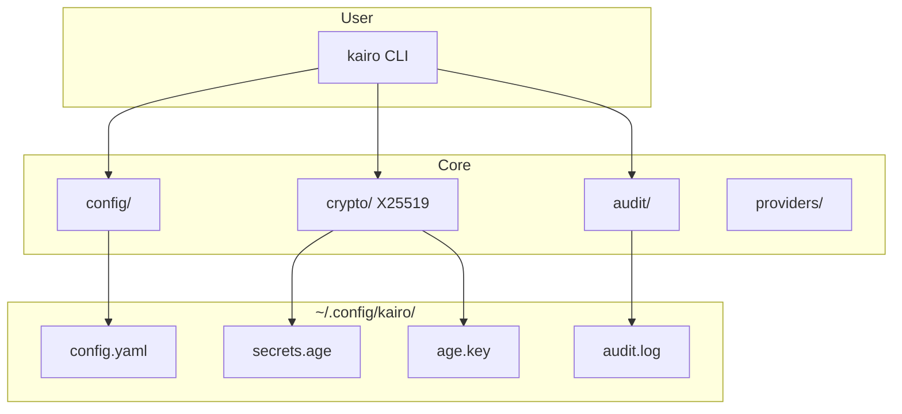

# Kairo

```text
 █████                 ███
░░███                 ░░░
 ░███ █████  ██████   ████  ████████   ██████
 ░███░░███  ░░░░░███ ░░███ ░░███░░███ ███░░███
 ░██████░    ███████  ░███  ░███ ░░░ ░███ ░███
 ░███░░███  ███░░███  ░███  ░███     ░███ ░███
 ████ █████░░████████ █████ █████    ░░██████
░░░░░ ░░░░░  ░░░░░░░░ ░░░░░ ░░░░░     ░░░░░░
```

[](https://github.com/dkmnx/kairo/releases)
[](https://go.dev/dl/)
[](https://github.com/dkmnx/kairo/actions)
[](LICENSE)

**Go CLI wrapper for Claude/Qwen Code with X25519 encryption and audit logging.**

## Overview

Kairo provides multi-provider API management with secure credential storage:

- **Multi-Harness**: Claude Code (default), Qwen Code
- **Secure Encryption**: Age (X25519) for all API keys
- **Key Rotation**: Periodic encryption key regeneration
- **Audit Logging**: Track all configuration changes
- **Cross-Platform**: Linux, macOS, Windows

## Quick Start

### Install

| Platform    | Command                                                                                 |
| ----------- | --------------------------------------------------------------------------------------- |
| Linux/macOS | `curl -sSL https://raw.githubusercontent.com/dkmnx/kairo/main/scripts/install.sh \| sh` |
| Windows     | `irm https://raw.githubusercontent.com/dkmnx/kairo/main/scripts/install.ps1 \| iex`     |

### Prerequisites

Kairo requires Claude Code or Qwen Code CLI:

```bash
# Claude Code
npm install -g @anthropic-ai/claude-code

# Qwen Code
npm install -g @qwen-code/qwen-code@latest
```

### Setup

```bash
kairo setup          # Interactive setup wizard
kairo list           # List configured providers
kairo zai "query"    # Use specific provider
kairo -- "query"     # Use default provider
```

## Architecture



## Commands

| Command                    | Description                    |
| -------------------------- | ------------------------------ |
| `kairo setup`              | Interactive setup wizard       |
| `kairo list`               | List configured providers      |
| `kairo delete <provider>`  | Delete provider                |
| `kairo <provider> [args]`  | Execute with specific provider |
| `kairo -- [args]`          | Execute with default provider  |
| `kairo harness get`        | Get current harness            |
| `kairo harness set <name>` | Set default harness            |
| `kairo update`             | Update to latest version       |
| `kairo version`            | Show version                   |
| `kairo completion <shell>` | Generate shell completion      |

Full reference: [docs/reference/configuration.md](docs/reference/configuration.md)

## Configuration

| OS      | Location                               |
| ------- | -------------------------------------- |
| Linux   | `~/.config/kairo/`                     |
| macOS   | `~/Library/Application Support/kairo/` |
| Windows | `%APPDATA%\kairo\`                     |

| File          | Purpose                 |
| ------------- | ----------------------- |
| `config.yaml` | Provider configurations |
| `secrets.age` | Encrypted API keys      |
| `age.key`     | Encryption private key  |
| `audit.log`   | Change history          |

## Security

- X25519 encryption for all API keys
- 0600 permissions on sensitive files
- In-memory only decryption
- Secure wrapper scripts for token passing

See [Security Architecture](docs/architecture/README.md#security-architecture)

## Documentation

- [User Guide](docs/guides/user-guide.md) - Installation and usage
- [Development Guide](docs/guides/development-guide.md) - Setup and contribution
- [Architecture](docs/architecture/README.md) - System design
- [Troubleshooting](docs/troubleshooting/README.md) - Common issues

Full documentation: [docs/README.md](docs/README.md)

## Development

```bash
just build        # Build binary
just test         # Run tests
just lint         # Run linters
just pre-release  # Format, lint, test
```

## Resources

- [GitHub](https://github.com/dkmnx/kairo)
- [Report Issues](https://github.com/dkmnx/kairo/issues)

---

**License:** [MIT](LICENSE) | **Author:** [dkmnx](https://github.com/dkmnx)
