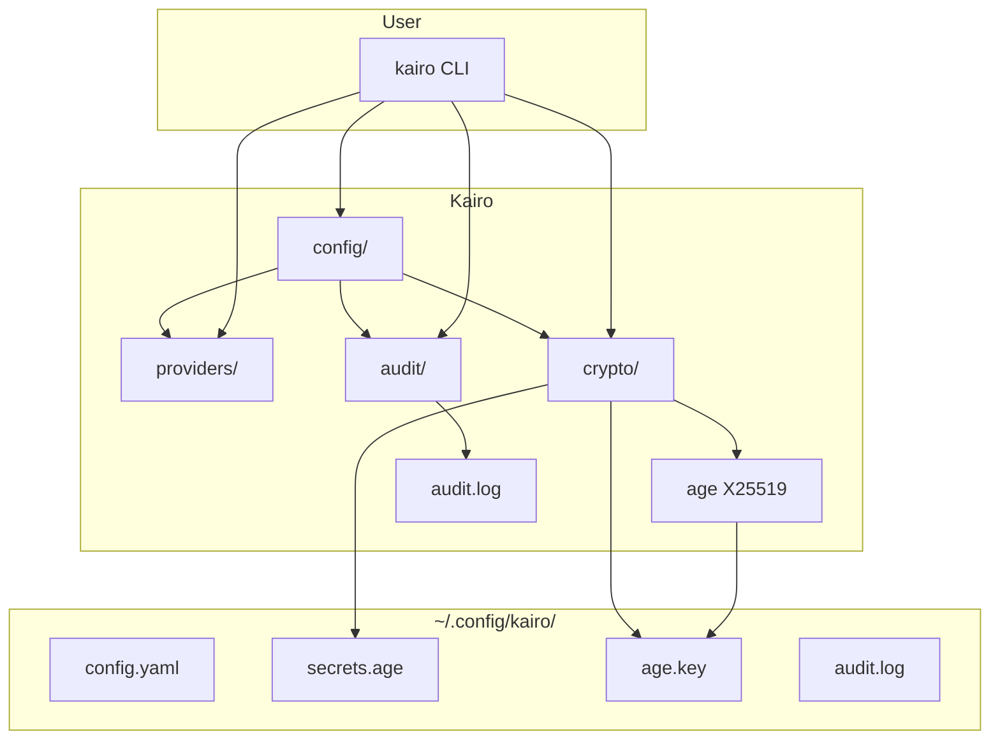

# Kairo

```text
 █████                 ███
░░███                 ░░░
 ░███ █████  ██████   ████  ████████   ██████
 ░███░░███  ░░░░░███ ░░███ ░░███░░███ ███░░███
 ░██████░    ███████  ░███  ░███ ░░░ ░███ ░███
 ░███░░███  ███░░███  ░███  ░███     ░███ ░███
 ████ █████░░████████ █████ █████    ░░██████
░░░░░ ░░░░░  ░░░░░░░░ ░░░░░ ░░░░░     ░░░░░░
```

[](https://github.com/dkmnx/kairo/releases)
[](https://go.dev/dl/)
[](https://github.com/dkmnx/kairo/actions)
[](LICENSE)

**Anthropic-powered CLI for multi-provider management with X25519 encryption and integrated audit trails.**

## Prerequisites

### Required: Claude Code CLI or Qwen Code CLI

Kairo acts as a wrapper around Claude Code or Qwen Code CLI to enable multi-provider support. You need to install at least one of them.

**Install Claude Code:**

- Visit: <https://claude.com/product/claude-code>
- Or via package managers:

  ```bash
  # Homebrew (macOS)
  brew install --cask claude-code

  # npm
  npm install -g @anthropic-ai/claude-code
  ```

**Install Qwen Code:**

- Visit: <https://qwenlm.github.io/qwen-code-docs/>
- Or via package managers:

  ```bash
  # npm
  npm install -g @qwen-code/qwen-code@latest
  ```

**Configure Qwen Code:**

Qwen Code requires model providers to be configured in `~/.qwen/settings.json`. Create this file with your providers:

> Note: Only Anthropic API providers are supported.

```json
{
  "modelProviders": {
    "anthropic": [
      {
        "id": "glm-4.7",
        "name": "GLM-4.7 [Z.AI Coding Plan] - Anthropic",
        "envKey": "ANTHROPIC_API_KEY",
        "baseUrl": "https://api.z.ai/api/anthropic"
      }
    ]
  }
}
```

Kairo automatically sets `ANTHROPIC_API_KEY` when using the Qwen harness.

**Verify installation:**

```bash
claude --version
# or
qwen --version
```

## Quick Start

### Install

| Platform      | Command                                                                                   |
| ------------- | ----------------------------------------------------------------------------------------- |
| Linux/macOS   | `curl -sSL https://raw.githubusercontent.com/dkmnx/kairo/main/scripts/install.sh \| sh`   |
| Windows       | `irm https://raw.githubusercontent.com/dkmnx/kairo/main/scripts/install.ps1 \| iex`       |

[Manual Installation](docs/guides/user-guide.md#manual-installation) | [Build from Source](docs/guides/development-guide.md#building)

### Setup

```bash
# Interactive setup wizard (can configure new or edit existing providers)
kairo setup

# List configured providers
kairo list

# Use specific provider
kairo zai "Help me write a function"

# Or use default provider (if set)
kairo -- "Quick question"
```

## System Architecture



## Features

| Feature                | Description                              |
| ---------------------- | ---------------------------------------- |
| **Multi-Harness**      | Claude Code (default), Qwen Code         |
| **Secure Encryption**  | Age (X25519) encryption for all API keys |
| **Key Rotation**       | Regenerate encryption keys periodically  |
| **Audit Logging**      | Track all configuration changes          |
| **Cross-Platform**     | Linux, macOS, Windows support            |

## Metrics

Performance metrics are opt-in for privacy. When enabled, kairo tracks:

- API call durations per provider
- Configuration operation timing
- Success/failure rates

### Enabling Metrics

```bash
# Enable for current session
kairo metrics enable

# Or set environment variable
export KAIRO_METRICS_ENABLED=true
```

### Viewing Metrics

```bash
# Display metrics in terminal
kairo metrics

# Export to JSON file
kairo metrics --output metrics.json

# Reset all metrics
kairo metrics reset
```

### Metrics Reference

| Metric            | Description                                |
| ----------------- | ------------------------------------------ |
| `operation`       | Type of operation (switch, config, etc.)   |
| `provider`        | Provider name                              |
| `count`           | Number of operations                       |
| `total_duration`  | Cumulative time spent                      |
| `avg_duration`    | Average operation time                     |
| `min_duration`    | Fastest operation                          |
| `max_duration`    | Slowest operation                          |
| `failure_count`   | Number of failures                         |

## Commands

### Core Commands

| Command                    | Description                          |
| -------------------------- | ------------------------------------ |
| `kairo setup`              | Interactive TUI setup wizard         |
| `kairo delete [provider]`  | Delete provider configuration        |
| `kairo list`               | List configured providers            |
| `kairo <provider> [args]`  | Execute with specific provider       |
| `kairo` (no args)          | Execute with default provider        |

### Utilities

| Command                    | Description                          |
| -------------------------- | ------------------------------------ |
| `kairo update`             | Check for new version                |
| `kairo harness [get        | set]`                                | Manage default harness (claude/qwen) |
| `kairo version`            | Show version info                    |

## Configuration

| OS         | Location                                     |
| ---------- | -------------------------------------------- |
| Linux      | `~/.config/kairo/`                           |
| macOS      | `~/Library/Application Support/kairo/`       |
| Windows    | `%APPDATA%\kairo\`                           |

| File          | Purpose                            | Permissions   |
| ------------- | ---------------------------------- | ------------- |
| `config.yaml` | Provider configurations (YAML)     | 0600          |
| `secrets.age` | Encrypted API keys                 | 0600          |
| `age.key`     | Encryption private key             | 0600          |
| `audit.log`   | Configuration change history       | 0600          |

## Documentation

### User Guides

| Guide                                                           | Description                  |
| --------------------------------------------------------------- | ---------------------------- |
| [User Guide](docs/guides/user-guide.md)                         | Installation and basic usage |
| [Audit Guide](docs/guides/audit-guide.md)                       | Audit log usage              |
| [Advanced Configuration](docs/guides/advanced-configuration.md) | Complex scenarios            |

### Developer Resources

| Resource                                                        | Description                      |
| --------------------------------------------------------------- | -------------------------------- |
| [Development Guide](docs/guides/development-guide.md)           | Setup and contribution           |
| [Architecture](docs/architecture/README.md)                     | System design and diagrams       |
| [Wrapper Scripts](docs/architecture/wrapper-scripts.md)         | Security design and rationale    |
| [Contributing](docs/contributing/README.md)                     | Contribution workflow            |

### Reference

| Resource                                                        | Description                            |
| --------------------------------------------------------------- | -------------------------------------- |
| [Development Guide](docs/guides/development-guide.md)           | Setup and contribution                 |
| [Architecture](docs/architecture/README.md)                     | System design and diagrams             |
| [Wrapper Scripts](docs/architecture/wrapper-scripts.md)         | Security design and rationale          |
| [Contributing](docs/contributing/README.md)                     | Contribution workflow                  |
| [Troubleshooting](docs/troubleshooting/README.md)               | Common issues and solutions            |
| [Changelog](CHANGELOG.md)                                       | Version history                        |

## Building

```bash
# Build
just build        # or: go build -o dist/kairo .

# Test
just test         # or: go test -race ./...

# Lint
just lint         # or: gofmt -w . && go vet ./...

# Format
just format       # or: gofmt -w .
```

## Security

- Age (X25519) encryption for all API keys
- 0600 permissions on sensitive files
- Secrets decrypted in-memory only
- Secure wrapper scripts for both Claude and Qwen harnesses
- Key generation on first run
- Use `kairo rotate` for periodic key rotation

## Project Structure

```text
kairo/
├── cmd/           # CLI commands (Cobra)
│   ├── setup.go   # Interactive wizard
│   ├── config.go  # Provider configuration
│   ├── switch.go  # Provider switching
│   └── ...
├── internal/      # Business logic
│   ├── audit/     # Audit logging
│   ├── config/    # YAML loading
│   ├── crypto/    # Age encryption
│   ├── providers/ # Provider registry
│   └── ...
└── pkg/           # Reusable utilities
    └── env/       # Cross-platform config dir
```

## Resources

- [GitHub](https://github.com/dkmnx/kairo)
- [Report Issues](https://github.com/dkmnx/kairo/issues)

---

**License:** [MIT](LICENSE) | **Author:** [dkmnx](https://github.com/dkmnx)
