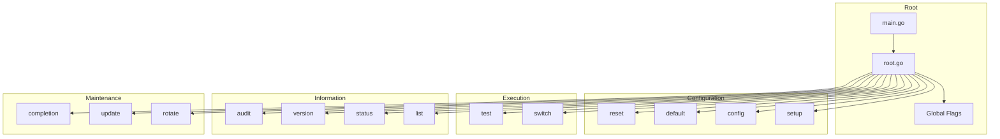

# Command Package (`cmd/`)

CLI command implementations using the Cobra framework.

## Structure

| File                | Purpose                                          |
| ------------------- | ------------------------------------------------ |
| `root.go`           | Root command, banner display, global flags       |
| `setup.go`          | Interactive configuration wizard                 |
| `config.go`         | Configure individual providers                   |
| `list.go`           | List all configured providers                    |
| `status.go`         | Test connectivity for all providers              |
| `test.go`           | Test specific provider connectivity              |
| `switch.go`         | Switch provider and execute CLI (Claude or Qwen) |
| `harness.go`        | Manage CLI harness (claude or qwen)              |
| `default.go`        | Get or set default provider                      |
| `reset.go`          | Remove provider configurations                   |
| `rotate.go`         | Rotate encryption key                            |
| `version.go`        | Display version information                      |
| `update.go`         | Check for and install updates                    |
| `completion.go`     | Shell completion support                         |
| `audit.go`          | View and export audit logs                       |

## Command Architecture



## Command Reference

### Setup Commands

| Command                    | Description                                        |
| -------------------------- | -------------------------------------------------- |
| `kairo setup`              | Interactive setup wizard for initial configuration |
| `kairo config <provider>`  | Configure a specific provider                      |

### Provider Management

| Command                       | Description                         |
| ----------------------------- | ----------------------------------- |
| `kairo list`                  | List all configured providers       |
| `kairo status`                | Test connectivity for all providers |
| `kairo test <provider>`       | Test specific provider              |
| `kairo default <provider>`    | Get or set default provider         |
| `kairo reset <provider\|all>` | Remove provider configuration       |

### Execution

| Command                                   | Description                                        |
| ----------------------------------------- | -------------------------------------------------- |
| `kairo switch <provider>`                 | Switch and execute CLI (claude or qwen)            |
| `kairo switch <provider> --harness qwen`  | Switch using Qwen CLI                              |
| `kairo switch <provider> --model <model>` | Override model (Qwen harness only)                 |
| `kairo harness get`                       | Get current default harness                        |
| `kairo harness set <harness>`             | Set default harness (claude or qwen)               |
| `kairo <provider> [args]`                 | Shorthand for switch (e.g., `kairo zai`)           |
| `kairo -- "query"`                        | Query mode using default provider                  |

### Maintenance

| Command                      | Description                   |
| ---------------------------- | ----------------------------- |
| `kairo rotate`               | Rotate encryption key         |
| `kairo update`               | Check for and install updates |
| `kairo version`              | Display version info          |
| `kairo completion <shell>`   | Generate shell completion     |
| `kairo audit <list\|export>` | View/export audit logs        |

## Adding a New Command

### 1. Create Command File

Create `cmd/newcommand.go`:

```go
package cmd

import (
    "fmt"
    "github.com/spf13/cobra"
)

var newCommand = &cobra.Command{
    Use:   "newcommand",
    Short: "Brief description",
    Long:  `Longer description with examples`,
    Run: func(cmd *cobra.Command, args []string) {
        // Implementation
    },
}

func init() {
    rootCmd.AddCommand(newCommand)
}
```

### 2. Add to Root Command

Import and add in `cmd/root.go`:

```go
import _ "github.com/dkmnx/kairo/cmd"  // Blank import for init()
```

### 3. Testing

```bash
go test ./cmd/... -run TestNewCommand
```

## Testing

```bash
# All cmd package tests
go test ./cmd/...

# With race detection
go test -race ./cmd/...

# Specific test file
go test -v ./cmd/... -run TestSetup

# Integration tests
go test -v ./cmd/... -run Integration
```

## Dependencies

- `github.com/spf13/cobra` - CLI framework
- `github.com/spf13/viper` - Configuration management
- Internal packages: `config`, `crypto`, `providers`, `validate`, `ui`, `audit`

## Global Flags

| Flag             | Purpose                          |
| ---------------- | -------------------------------- |
| `-v, --verbose`  | Enable verbose output            |
| `-h, --help`     | Show help for command            |
| `--harness`      | CLI harness to use (claude/qwen) |

## Banner Display

The root command displays version and provider information:

```text
kairo v1.2.0 - Provider: zai
```

This is rendered from `internal/version/version.go` and `providers` package.

## CLI Harnesses

Kairo supports multiple CLI harnesses:

| Harness  | CLI Binary | Description           |
| -------- | ---------- | --------------------- |
| `claude` | `claude`   | Claude Code (default) |
| `qwen`   | `qwen`     | Qwen Code             |

### Using Harnesses

```bash
# Use Qwen harness for a specific provider
kairo switch zai --harness qwen

# Override model for Qwen
kairo switch zai --harness qwen --model qwen-turbo

# Set default harness globally
kairo harness set qwen

# Get current harness
kairo harness get
```

The `--model` flag is passed through to Qwen CLI. If not specified, uses the provider's configured model.

## Provider Shorthand

Users can use provider name directly instead of `switch`:

```bash
# These are equivalent:
kairo switch zai "Help me"
kairo zai "Help me"
```

This is handled in `root.go` by checking if the first argument is a valid provider name.

## Audit Integration

All configuration commands log changes to `~/.config/kairo/audit.log`:

- `config` - Logs api_key, base_url, model changes
- `default` - Logs default provider changes
- `reset` - Logs provider resets
- `rotate` - Logs key rotations
- `setup` - Logs provider setup
- `switch` - Logs provider switches

See: [docs/guides/audit-guide.md](../guides/audit-guide.md)
