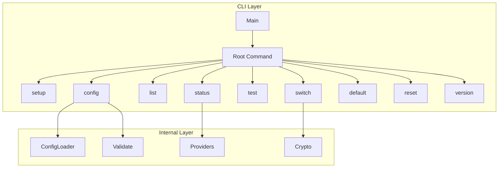

# Command Package (`cmd/`)

CLI command implementations using the Cobra framework.

## Structure

| File | Purpose |
|------|---------|
| `root.go` | Root command, banner display, global flags |
| `setup.go` | Interactive configuration wizard |
| `config.go` | Configure individual providers |
| `list.go` | List all configured providers |
| `status.go` | Test connectivity for all providers |
| `test.go` | Test specific provider connectivity |
| `switch.go` | Switch provider and execute Claude |
| `default.go` | Get or set default provider |
| `reset.go` | Remove provider configurations |
| `version.go` | Display version information |
| `completion.go` | Shell completion support |

## Setup

```bash
# No additional setup required - commands are part of main binary
cd /path/to/kairo
go build -o kairo .
```

## Testing

```bash
# Run all cmd package tests
go test ./cmd/...

# Run with race detection
go test -race ./cmd/...

# Run specific test file
go test -v ./cmd/... -run TestSetup
```

## Architecture



## Dependencies

- `github.com/spf13/cobra` - CLI framework
- `github.com/spf13/viper` - Configuration management
- Internal packages: `config`, `crypto`, `providers`, `validate`, `ui`
