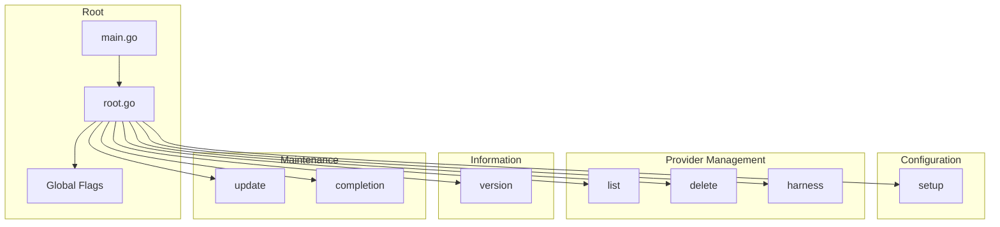

# Command Package (`cmd/`)

CLI command implementations using the Cobra framework.

## Structure

| File               | Purpose                                        |
| ------------------ | ---------------------------------------------- |
| `root.go`          | Root command, provider execution, global flags |
| `setup.go`         | Interactive setup and edit wizard              |
| `list.go`          | List all configured providers                  |
| `delete.go`        | Remove provider configurations                 |
| `harness.go`       | Manage CLI harness (claude or qwen)            |
| `update.go`        | Update to latest version                       |
| `version.go`       | Display version information                    |
| `completion.go`    | Shell completion support                       |
| `audit_helpers.go` | Audit logging helpers                          |
| `util.go`          | Utility functions                              |

## Command Architecture



## Command Reference

### Setup Commands

| Command       | Description                       |
| ------------- | --------------------------------- |
| `kairo setup` | Interactive setup and edit wizard |

### Provider Management

| Command                   | Description                   |
| ------------------------- | ----------------------------- |
| `kairo list`              | List all configured providers |
| `kairo delete <provider>` | Remove provider configuration |

### Execution

| Command                                    | Description                                    |
| ------------------------------------------ | ---------------------------------------------- |
| `kairo <provider> [args]`                  | Execute with provider (e.g., `kairo zai`)      |
| `kairo -- "query"`                         | Query using default provider                   |
| `kairo --harness <name> <provider> [args]` | Execute with specific harness (claude or qwen) |

### Harness Management

| Command                    | Description                          |
| -------------------------- | ------------------------------------ |
| `kairo harness get`        | Get current default harness          |
| `kairo harness set <name>` | Set default harness (claude or qwen) |

### Maintenance

| Command                    | Description               |
| -------------------------- | ------------------------- |
| `kairo update`             | Update to latest version  |
| `kairo version`            | Display version info      |
| `kairo completion <shell>` | Generate shell completion |

## Testing

```bash
# All cmd package tests
go test ./cmd/...

# With race detection
go test -race ./cmd/...

# Specific test file
go test -v ./cmd/... -run TestSetup

# Integration tests
go test -v ./cmd/... -run Integration
```

## Dependencies

- `github.com/spf13/cobra` - CLI framework
- Internal packages: `config`, `crypto`, `providers`, `validate`, `ui`, `wrapper`, `version`

## Global Flags

| Flag            | Purpose                                         |
| --------------- | ----------------------------------------------- |
| `-v, --verbose` | Enable verbose output                           |
| `-h, --help`    | Show help for command                           |
| `--config`      | Config directory (default is platform-specific) |

## Global Flags

| Flag            | Purpose                                         |
| --------------- | ----------------------------------------------- |
| `-v, --verbose` | Enable verbose output                           |
| `-h, --help`    | Show help for command                           |
| `--config`      | Config directory (default is platform-specific) |
| `--harness`     | CLI harness to use (claude or qwen)            |

## Banner Display

The root command displays version and provider information:

```text
kairo v1.2.0 - Provider: zai
```

This is rendered from `internal/version/version.go` and `providers` package.

## CLI Harnesses

Kairo supports multiple CLI harnesses:

| Harness  | CLI Binary | Description           |
| -------- | ---------- | --------------------- |
| `claude` | `claude`   | Claude Code (default) |
| `qwen`   | `qwen`     | Qwen Code             |

### Using Harnesses

```bash
# Use Qwen harness for a specific provider
kairo --harness qwen zai "query"

# Set default harness globally
kairo harness set qwen

# Get current harness
kairo harness get
```

The model is automatically passed from the provider's configuration.

## Provider Shorthand

Users can use provider name directly:

```bash
# Execute with provider:
kairo zai "Help me"
```

This is handled in `root.go` by checking if the first argument is a valid provider name.

## Audit Integration

Configuration changes are logged internally:

- `setup` - Logs provider setup and changes
- `delete` - Logs provider removals
- Provider execution - Logs provider usage
