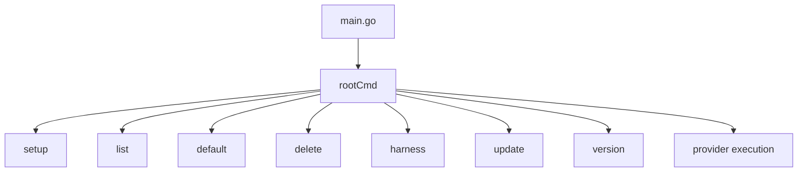

# Command Package (`cmd/`)

CLI command implementations using Cobra.

## Structure

| File                 | Purpose                                                         |
| -------------------- | --------------------------------------------------------------- |
| `root.go`            | Root command, flag wiring, provider resolution                  |
| `setup.go`           | Interactive setup and reset-secrets flow                        |
| `setup_prompts.go`   | Prompt helpers for provider setup                               |
| `list.go`            | List configured providers                                       |
| `default.go`         | Get or set default provider                                     |
| `delete.go`          | Remove provider configurations                                  |
| `harness.go`         | Manage default harness (`claude`, `qwen`, `pi`, or `crush`)     |
| `execution.go`       | Execute Claude/Qwen with provider configuration                 |
| `update.go`          | Update to latest version                                        |
| `version.go`         | Version command                                                 |
| `completion.go`      | Shell completion script generation                              |
| `context.go`         | `CLIContext` state and config cache access                      |
| `util.go`            | Shared helpers and process utilities                            |

## Command Architecture


```mermaid
flowchart TB
    Main[main.go] --> Root[rootCmd]
    Root --> Setup[setup]
    Root --> List[list]
    Root --> Default[default]
    Root --> Delete[delete]
    Root --> Harness[harness]
    Root --> Update[update]
    Root --> Version[version]
    Root --> Exec[provider execution]
```

## Command Reference

### Setup and Configuration

| Command                       | Description                                      |
| ----------------------------- | ------------------------------------------------ |
| `kairo setup`                 | Interactive setup and edit wizard                |
| `kairo setup --reset-secrets` | Regenerate encryption key and re-enter API keys  |
| `kairo list`                  | List all configured providers                    |
| `kairo default [provider]`    | Get or set the default provider                  |
| `kairo delete <provider>`     | Remove a provider configuration                  |

### Harness Management

| Command                     | Description                                             |
| --------------------------- | ------------------------------------------------------- |
| `kairo harness get`         | Get current default harness                             |
| `kairo harness set <name>`  | Set default harness (`claude`, `qwen`, `pi`, `crush`)   |

### Execution

| Command                                  | Description                             |
| ---------------------------------------- | --------------------------------------- |
| `kairo <provider> [args]`                | Execute with a specific provider        |
| `kairo -- [args]`                        | Execute with the default provider       |
| `kairo --harness qwen <provider> [args]` | Execute with a specific harness         |
| `kairo --yolo <provider> [args]`         | Skip harness permission prompts         |

### Maintenance

| Command                           | Description                             |
| --------------------------------- | --------------------------------------- |
| `kairo update`                    | Update to latest version                |
| `kairo version`                   | Display version info                    |

| `kairo completion [shell]`        | Generate shell completion script        |

## Flags

### Persistent Flags

| Flag            | Purpose                                         |
| --------------- | ----------------------------------------------- |
| `--config`      | Config directory (default is platform-specific) |
| `-v, --verbose` | Enable verbose output                           |

### Root Execution Flags

| Flag         | Purpose                                                                                                                     |
| ------------ | --------------------------------------------------------------------------------------------------------------------------- |
| `--harness`  | Harness to use for execution (`claude`, `qwen`, `pi`, or `crush`)                                                           |
| `-y, --yolo` | Skip permission prompts. Maps to `--dangerously-skip-permissions` for Claude, `--yolo` for Qwen and Crush. No effect on Pi. |

## CLIContext

`CLIContext` centralizes runtime state for the command layer:

- config directory override
- verbose mode
- config cache
- root context for cancellation-aware operations

This keeps command handlers thin while avoiding direct business logic in `cmd/`.

## Harnesses

| Harness  | CLI Binary | Notes                                         |
| -------- | ---------- | --------------------------------------------- |
| `claude` | `claude`   | Default harness                               |
| `qwen`   | `qwen`     | Uses `ANTHROPIC_API_KEY`                      |
| `pi`     | `pi`       | Passes all provider keys                      |
| `crush`  | `crush`    | Uses provider-specific `API_KEY` env variable |

Kairo selects the harness in this order:

1. `--harness` flag
2. `default_harness` from `config.yaml`
3. fallback to `claude`

## Testing

```bash
go test ./cmd/...
go test -race ./cmd/...
go test -v ./cmd/... -run TestSetup
```

## Dependencies

- `github.com/spf13/cobra`
- Internal packages: `config`, `crypto`, `providers`, `ui`, `validate`, `version`, `wrapper`
