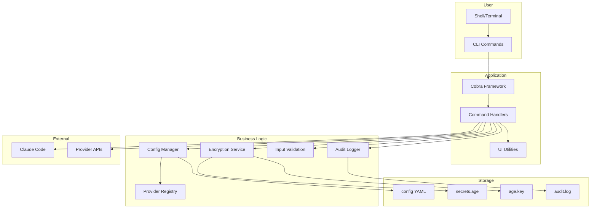
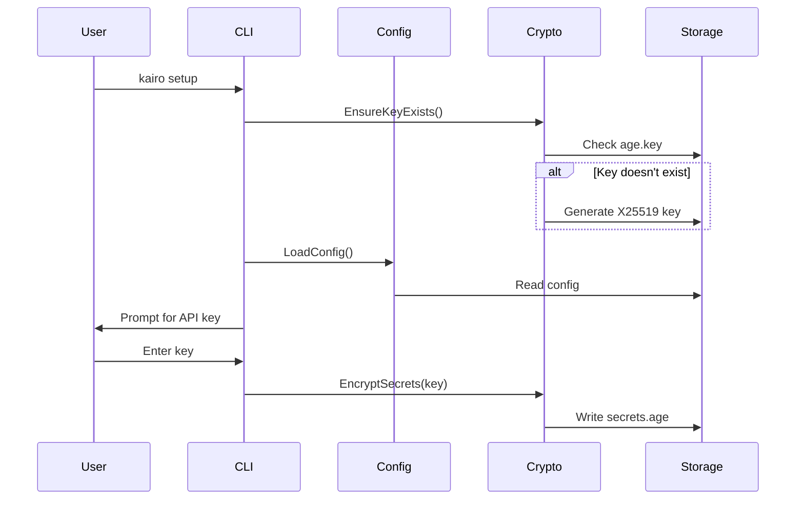
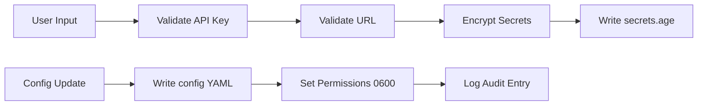
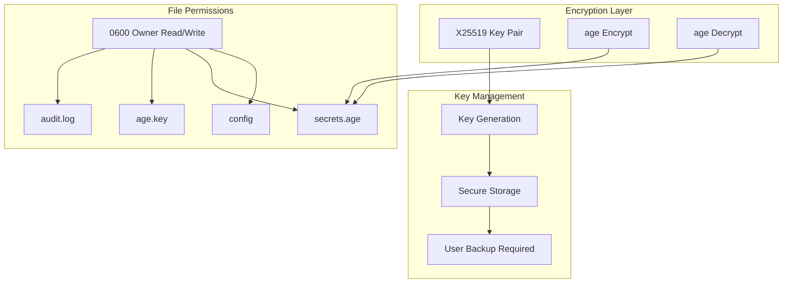
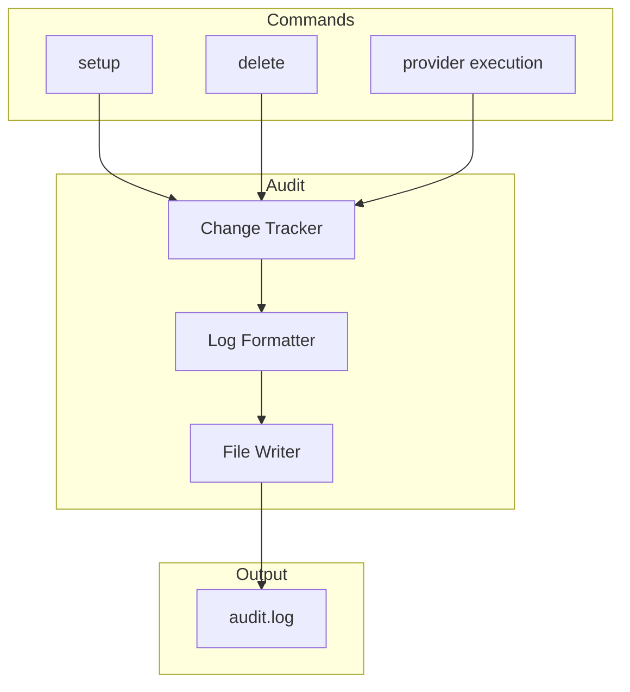
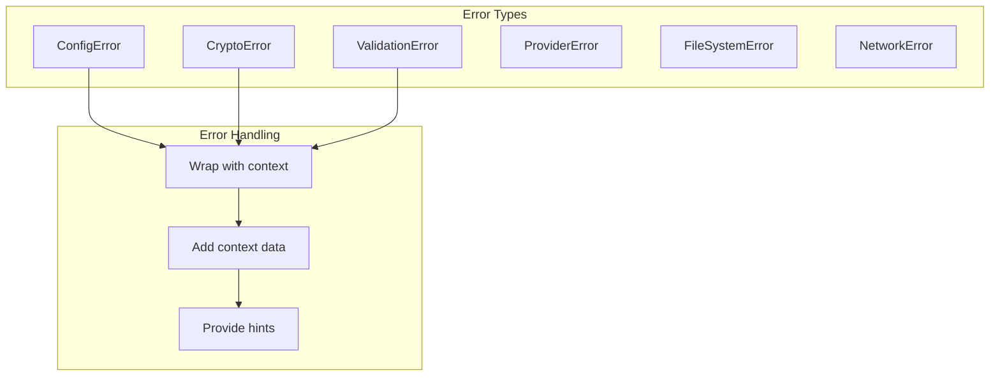
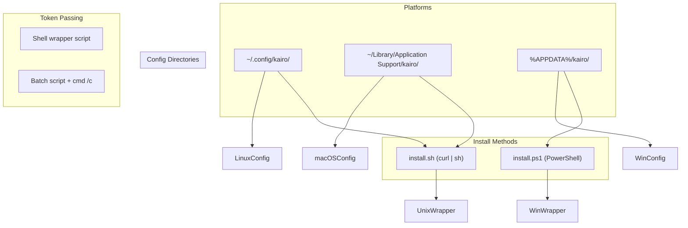

# Architecture

System architecture and design documentation for Kairo.

## Overview

Kairo is a Go CLI tool for managing Claude Code API providers with:

- **Age (X25519) encryption** for secure API key storage
- **Multi-provider support** for switching between providers
- **Audit logging** for tracking configuration changes

## System Architecture



## Component Interaction



## Directory Structure

```text
kairo/
├── cmd/                 # CLI commands (Cobra)
│   ├── root.go          # Root command & provider execution
│   ├── setup.go         # Interactive setup & edit
│   ├── list.go          # List providers
│   ├── delete.go        # Delete provider
│   ├── harness.go       # Harness management
│   ├── update.go        # Update CLI
│   ├── version.go       # Version info
│   ├── completion.go     # Shell completion
│   ├── audit_helpers.go # Audit logging helpers
│   └── util.go         # Utility functions
├── internal/            # Business logic
│   ├── audit/           # Audit logging
│   ├── config/          # Config loading & caching
│   ├── crypto/          # age encryption
│   ├── errors/          # Typed errors
│   ├── providers/       # Provider registry
│   ├── ui/              # UI utilities
│   ├── validate/        # Input validation
│   ├── version/         # Version information
│   └── wrapper/        # Secure wrapper scripts
├── pkg/                 # Reusable utilities
│   └── env/             # Environment helpers
├── docs/                # Documentation
│   ├── architecture/    # This directory
│   ├── contributing/    # Contribution guidelines
│   ├── guides/          # User & dev guides
│   ├── reference/       # Reference documentation
│   └── troubleshooting/ # Common issues
├── scripts/             # Install scripts
└── justfile             # Command runner
```

## Data Flow: Provider Configuration



## Security Architecture



## Audit Logging



## Configuration Schema

```yaml
# ~/.config/kairo/config.yaml
default_provider: zai
default_harness: claude
providers:
  zai:
    name: Z.AI
    base_url: https://api.z.ai/api/anthropic
    model: glm-4.7
    env_vars:
      - ANTHROPIC_DEFAULT_HAIKU_MODEL=glm-4.7-flash
  anthropic:
    name: Native Anthropic
```

## Provider Registry

| Provider  | Base URL                   | Model           | API Key Required |
| --------- | -------------------------- | --------------- | ---------------- |
| anthropic | -                          | -               | No               |
| zai       | api.z.ai/api/anthropic     | glm-4.7         | Yes              |
| minimax   | api.minimax.io/anthropic   | MiniMax-M2.5    | Yes              |
| kimi      | api.kimi.com/coding        | kimi-for-coding | Yes              |
| deepseek  | api.deepseek.com/anthropic | deepseek-chat   | Yes              |
| custom    | user-defined               | user-defined    | Yes              |

## Error Handling



## Dependencies

### Runtime Dependencies

| Package                  | Purpose           |
| ------------------------ | ----------------- |
| `filippo.io/age`         | X25519 encryption |
| `github.com/spf13/cobra` | CLI framework     |
| `gopkg.in/yaml.v3`       | YAML parsing      |

### Development Dependencies

| Package                         | Purpose            |
| ------------------------------- | ------------------ |
| `github.com/Masterminds/semver` | Version comparison |
| `github.com/stretchr/testify`   | Testing assertions |

## Design Principles

### 1. Security First

- All API keys encrypted at rest
- 0600 permissions on sensitive files
- No plaintext secrets in logs
- HTTPS-only for provider APIs

### 2. User Experience

- Interactive setup wizard
- Clear error messages with hints
- Colored terminal output
- Shell completion support

### 3. Maintainability

- Clean package structure
- Comprehensive test coverage
- Typed error handling
- Documentation-driven design

### 4. Extensibility

- Provider registry pattern
- Configurable via environment
- Exportable audit logs
- Modular architecture

## Cross-Platform Support



### Platform-Specific Implementations

| Feature          | Linux/macOS                 | Windows                    |
| ---------------- | --------------------------- | -------------------------- |
| Config Directory | `~/.config/kairo/`          | `%APPDATA%\kairo\`         |
| Install Script   | `install.sh` (curl \| sh)   | `install.ps1` (PowerShell) |
| Token Passing    | Shell wrapper (`#!/bin/sh`) | Batch script (`.bat`)      |
| Shell Completion | bash, zsh, fish             | PowerShell                 |

### Key Cross-Platform Code

```go
// Cross-platform config directory (pkg/env/env.go)
if runtime.GOOS == "windows" {
    return filepath.Join(home, "AppData", "Roaming", "kairo")
}
return filepath.Join(home, ".config", "kairo")

// Cross-platform token passing (cmd/switch.go)
if isWindows {
    // Generate .bat file with batch syntax
    scriptContent = "@echo off\r\n"
    // ...
} else {
    // Generate shell script with sh syntax
    scriptContent = "#!/bin/sh\n"
    // ...
}
```

### Testing on Windows

```go
// Skip Unix permission tests on Windows
if runtime.GOOS == "windows" {
    t.Skip("Windows does not support Unix-style permissions")
}
```

See also: [pkg/env](../pkg/README.md), [cmd/switch.go](../../cmd/switch.go)
