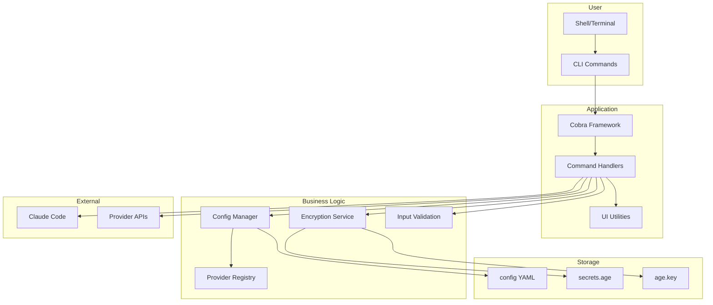
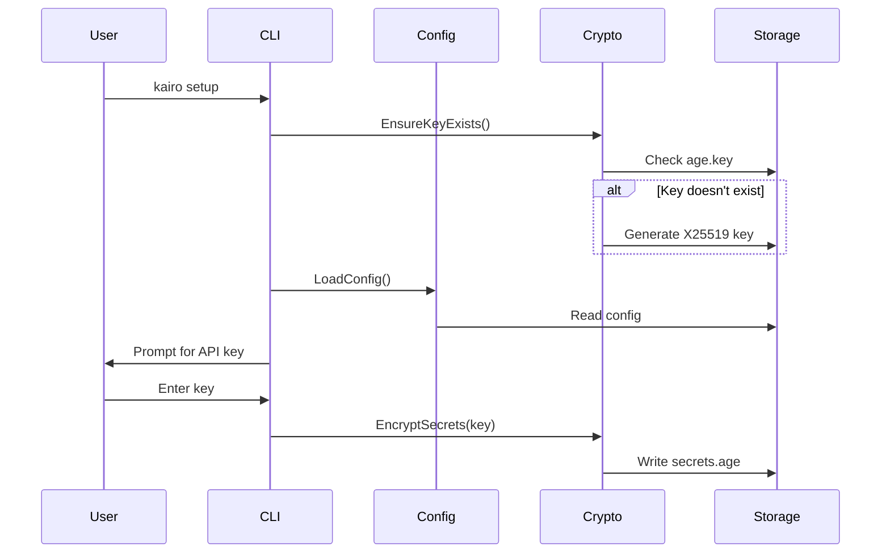
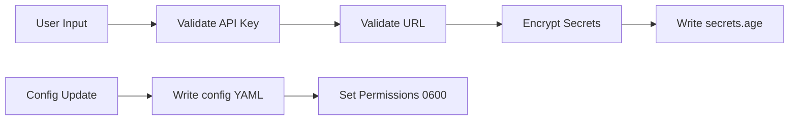
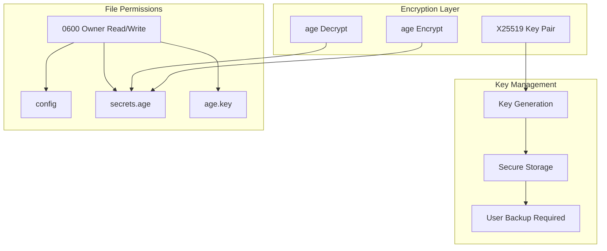

# Architecture

## Overview

Kairo is a Go CLI tool for managing Claude Code API providers with encrypted secrets management using age (X25519) encryption.

## System Architecture



## Component Interaction



## Directory Structure

```text
kairo/
├── cmd/                 # CLI commands (Cobra)
│   ├── root.go          # Root command
│   ├── setup.go         # Interactive setup
│   ├── config.go        # Provider config
│   ├── list.go          # List providers
│   ├── status.go        # Test all providers
│   ├── test.go          # Test provider
│   ├── switch.go        # Switch & exec
│   ├── default.go       # Default provider
│   ├── reset.go         # Reset config
│   └── version.go       # Version info
├── internal/            # Business logic
│   ├── config/          # Config loading
│   ├── crypto/          # age encryption
│   ├── providers/       # Provider registry
│   ├── validate/        # Input validation
│   └── ui/              # UI utilities
├── pkg/                 # Reusable utilities
│   └── env/             # Environment helpers
├── docs/                # Documentation
├── scripts/             # Install scripts
└── Makefile             # Build targets
```

## Data Flow: Provider Configuration



## Security Architecture



## Configuration Schema

```yaml
# ~/.config/kairo/config
default_provider: zai
providers:
  zai:
    name: Z.AI
    base_url: https://api.z.ai/api/anthropic
    model: glm-4.7
    env_vars:
      - ANTHROPIC_DEFAULT_HAIKU_MODEL=glm-4.5-air
  anthropic:
    name: Native Anthropic
    base_url: ""
    model: ""
```

## Provider Registry

| Provider     | Base URL                     | Model               | API Key Required    |
| ------------ | ---------------------------- | ------------------- | ------------------- |
| anthropic    | -                            | -                   | No                  |
| zai          | api.z.ai/api/anthropic       | glm-4.7             | Yes                 |
| minimax      | api.minimax.io/anthropic     | Minimax-M2.1        | Yes                 |
| kimi         | api.kimi.com/coding          | kimi-for-coding     | Yes                 |
| deepseek     | api.deepseek.com/anthropic   | deepseek-chat       | Yes                 |
| custom       | user-defined                 | user-defined        | Yes                 |
