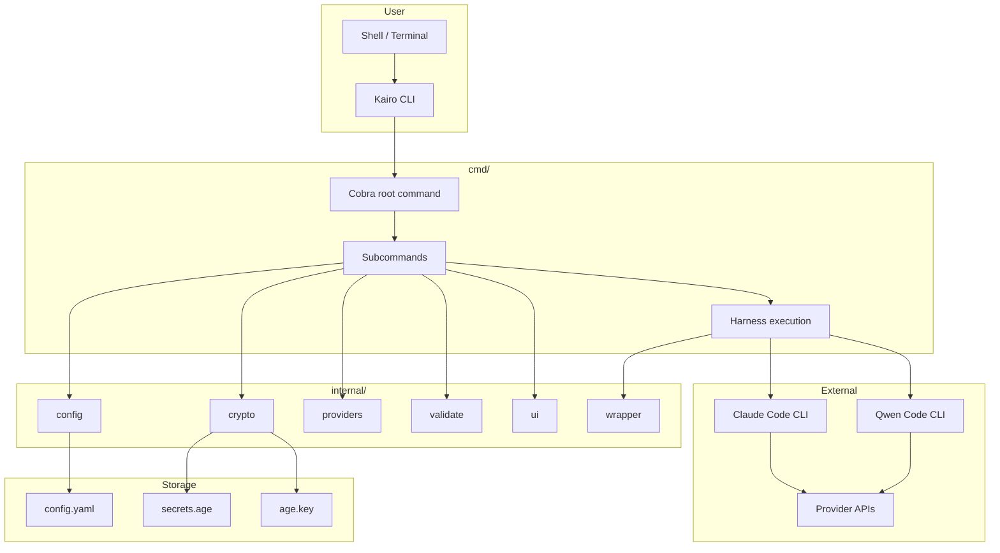
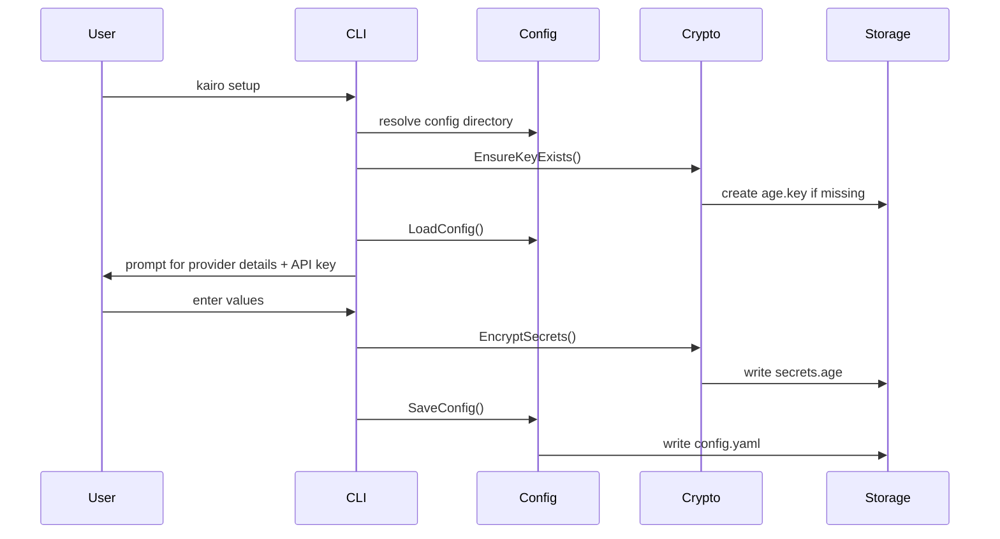
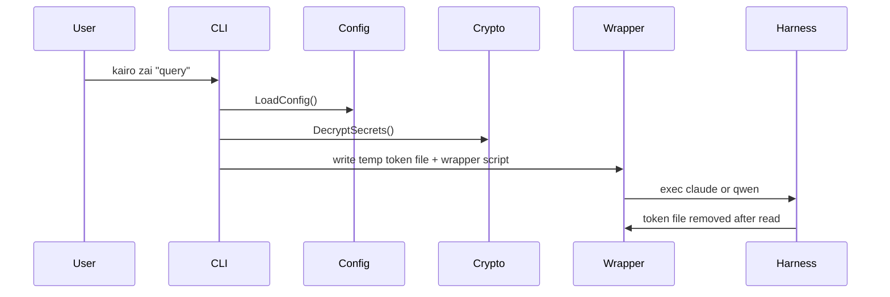

# Architecture

System architecture and design documentation for Kairo.

## Overview

Kairo is a Go CLI for routing Claude Code or Qwen Code through configured providers while keeping API keys encrypted at rest.

Core characteristics:

- Cobra-based CLI command layer
- age/X25519 encryption for API keys
- Built-in provider registry plus custom providers
- Secure wrapper scripts for passing credentials to external harness CLIs
- Context-aware config, crypto, and update operations

## System Architecture


```mermaid
flowchart TB
    subgraph User
        CLI[Kairo CLI]
        Shell[Shell / Terminal]
    end

    subgraph CommandLayer[cmd/]
        Cobra[Cobra root command]
        Commands[Subcommands]
        Execution[Harness execution]
    end

    subgraph Core[internal/]
        Config[config]
        Crypto[crypto]
        Providers[providers]
        Validate[validate]
        UI[ui]
        Wrapper[wrapper]
    end

    subgraph Storage
        ConfigFile[config.yaml]
        SecretsFile[secrets.age]
        KeyFile[age.key]
    end

    subgraph External
        Claude[Claude Code CLI]
        Qwen[Qwen Code CLI]
        APIs[Provider APIs]
    end

    Shell --> CLI
    CLI --> Cobra
    Cobra --> Commands
    Commands --> Execution
    Commands --> Config
    Commands --> Crypto
    Commands --> Providers
    Commands --> Validate
    Commands --> UI
    Execution --> Wrapper
    Config --> ConfigFile
    Crypto --> SecretsFile
    Crypto --> KeyFile
    Execution --> Claude
    Execution --> Qwen
    Claude --> APIs
    Qwen --> APIs
```

## Setup Flow


```mermaid
sequenceDiagram
    participant User
    participant CLI
    participant Config
    participant Crypto
    participant Storage

    User->>CLI: kairo setup
    CLI->>Config: resolve config directory
    CLI->>Crypto: EnsureKeyExists()
    Crypto->>Storage: create age.key if missing
    CLI->>Config: LoadConfig()
    CLI->>User: prompt for provider details + API key
    User->>CLI: enter values
    CLI->>Crypto: EncryptSecrets()
    Crypto->>Storage: write secrets.age
    CLI->>Config: SaveConfig()
    Config->>Storage: write config.yaml
```

## Execution Flow


```mermaid
sequenceDiagram
    participant User
    participant CLI
    participant Config
    participant Crypto
    participant Wrapper
    participant Harness

    User->>CLI: kairo zai "query"
    CLI->>Config: LoadConfig()
    CLI->>Crypto: DecryptSecrets()
    CLI->>Wrapper: write temp token file + wrapper script
    Wrapper->>Harness: exec claude or qwen
    Harness->>Wrapper: token file removed after read
```

## Directory Structure

```text
kairo/
├── cmd/                 # CLI commands and execution flow
├── internal/
│   ├── config/          # Config loading, caching, migration, paths
│   ├── crypto/          # age/X25519 key management and encryption
│   ├── errors/          # Typed errors
│   ├── providers/       # Built-in provider registry
│   ├── ui/              # Terminal output and prompts
│   ├── validate/        # Validation helpers
│   ├── version/         # Build metadata
│   └── wrapper/         # Secure wrapper scripts
├── docs/                # Documentation
├── scripts/             # Install and helper scripts
├── main.go              # Entry point
└── justfile             # Development commands
```

## Configuration Schema

```yaml
default_provider: zai
default_harness: claude
default_models:
  zai: glm-5.1
providers:
  zai:
    name: Z.AI
    base_url: https://api.z.ai/api/anthropic
    model: glm-5.1
    env_vars:
      - ANTHROPIC_DEFAULT_HAIKU_MODEL=glm-4.7-flash
```

Notes:

- API keys are stored in `secrets.age`, not `config.yaml`
- `default_harness` is optional and defaults to `claude`
- `default_models` is migration metadata for built-in providers

## Provider Registry

| Provider   | Base URL                             | Model             | API Key Required |
| ---------- | ------------------------------------ | ----------------- | ---------------- |
| `zai`      | `https://api.z.ai/api/anthropic`     | `glm-5.1`         | Yes              |
| `minimax`  | `https://api.minimax.io/anthropic`   | `MiniMax-M2.7`    | Yes              |
| `deepseek` | `https://api.deepseek.com/anthropic` | `deepseek-chat`   | Yes              |
| `kimi`     | `https://api.kimi.com/coding/`       | `kimi-for-coding` | Yes              |
| `custom`   | user-defined                         | user-defined      | Yes              |

## Security Architecture

Kairo keeps credentials out of normal child-process environments by combining encrypted storage with temporary wrapper scripts.

- `age.key`: X25519 private key file
- `secrets.age`: age-encrypted API key data
- Temporary auth directory: `0700`
- Temporary token file: `0600`
- Unix wrapper: `/bin/sh` script
- Windows wrapper: PowerShell `.ps1` script

See [Wrapper Scripts](wrapper-scripts.md) for the detailed design.

## Cross-Platform Support

| Feature           | Linux/macOS                       | Windows                                 |
| ----------------- | --------------------------------- | --------------------------------------- |
| Config directory  | `~/.config/kairo/`                | `%USERPROFILE%\AppData\Roaming\kairo\`  |
| Install script    | `scripts/install.sh`              | `scripts/install.ps1`                   |
| Wrapper script    | POSIX shell script                | PowerShell script                       |
| Harness execution | direct executable / shell wrapper | `powershell -File <wrapper>.ps1`        |

### Key Code References

- Config directory resolution: `internal/config/env.go`
- Secure wrapper generation: `internal/wrapper/wrapper.go`
- Harness execution: `cmd/execution.go`
- Root command and flag wiring: `cmd/root.go`

## Design Principles

### Security First

- API keys encrypted at rest
- Sensitive files written with private permissions
- Secrets passed to harness CLIs via temporary wrapper flow
- No plaintext secrets stored in `config.yaml`

### User Experience

- Interactive setup flow
- Clear typed errors and recovery guidance
- Colored terminal output
- Configurable default provider and harness

### Maintainability

- Small internal packages with focused responsibilities
- Table-driven tests and integration coverage
- Config migration support for built-in provider defaults

### Extensibility

- Registry-driven built-in providers
- Custom provider support
- Harness abstraction for Claude and Qwen
