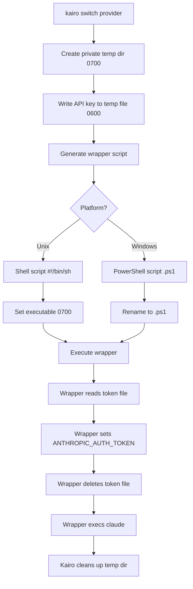

# Wrapper Scripts: Architecture and Security Design

## Overview

The wrapper script mechanism is a critical security feature in Kairo's `switch` command. It addresses the fundamental challenge of securely passing API credentials to the Claude Code process without exposing them in process listings or environment variables.

## The Security Problem

When executing external commands with sensitive credentials, several attack vectors exist:

### 1. Process Environment Exposure

On Unix-like systems, any user on the system can read a process's environment variables:

```bash
# Any user can read another process's environment
cat /proc/<PID>/environ | tr '\0' '\n'
```

This means that if we simply set `ANTHROPIC_AUTH_TOKEN` as an environment variable, it would be visible to:

- Other users on shared systems
- Process monitoring tools
- Core dumps
- System administrators

### 2. Process Listing (ps)

While modern `ps` typically doesn't show environment variables by default, some configurations and alternatives do:

```bash
ps eww -p <PID>  # Shows full environment
```

### 3. Shell History

Passing tokens as command-line arguments would leave them in shell history:

```bash
# INSECURE - leaves token in history
claude ANTHROPIC_AUTH_TOKEN=sk-ant-...
```

## The Solution: Temporary Wrapper Scripts

Kairo solves this problem using a **write-and-execute pattern** with temporary wrapper scripts:

### Architecture Flow



### Implementation Details

#### Step 1: Create Private Temp Directory

```go
func createTempAuthDir() (string, error) {
    authDir, err := os.MkdirTemp("", "kairo-auth-")
    if err != nil {
        return "", err
    }

    // Set 0700 permissions (owner only)
    if err := os.Chmod(authDir, 0700); err != nil {
        os.RemoveAll(authDir)
        return "", err
    }

    return authDir, nil
}
```

**Security Properties:**

- Directory created in system temp directory
- Permissions set to `0700` (owner read/write/execute only)
- Only the current user can access the directory
- Directory is automatically cleaned up on exit

#### Step 2: Write Token File

```go
func writeTempTokenFile(authDir, token string) (string, error) {
    f, err := os.CreateTemp(authDir, "token-")
    if err != nil {
        return "", err
    }

    if _, err := f.WriteString(token); err != nil {
        f.Close()
        os.Remove(f.Name())
        return "", err
    }

    if err := f.Close(); err != nil {
        os.Remove(f.Name())
        return "", err
    }

    // Set 0600 permissions (owner read/write only)
    if err := os.Chmod(f.Name(), 0600); err != nil {
        os.Remove(f.Name())
        return "", err
    }

    return f.Name(), nil
}
```

**Security Properties:**

- File created within private directory
- Permissions set to `0600` (owner read/write only)
- File contains only the API token (plaintext in memory only)
- Defense in depth: private directory + private file

#### Step 3: Generate Platform-Specific Wrapper

**Unix (Linux/macOS):**

```go
scriptContent = "#!/bin/sh\n"
scriptContent += "# Generated by kairo - DO NOT EDIT\n"
scriptContent += "# This script will be automatically deleted after execution\n"
scriptContent += fmt.Sprintf("export ANTHROPIC_AUTH_TOKEN=$(cat %q)\n", tokenPath)
scriptContent += fmt.Sprintf("rm -f %q\n", tokenPath)
scriptContent += "exec " + fmt.Sprintf("%q", claudePath)
for _, arg := range claudeArgs {
    scriptContent += " " + fmt.Sprintf("%q", arg)
}
scriptContent += "\n"
```

**Windows (PowerShell):**

```go
scriptContent = "# Generated by kairo - DO NOT EDIT\r\n"
scriptContent += "# This script will be automatically deleted after execution\r\n"
scriptContent += fmt.Sprintf("$env:ANTHROPIC_AUTH_TOKEN = Get-Content -Path %q -Raw\r\n", tokenPath)
scriptContent += fmt.Sprintf("Remove-Item -Path %q -Force\r\n", tokenPath)
scriptContent += fmt.Sprintf("& %q", claudePath)
for _, arg := range claudeArgs {
    scriptContent += fmt.Sprintf(" %s", escapePowerShellArg(arg))
}
scriptContent += "\r\n"
```

**Security Properties:**

- Token never appears in command-line arguments
- Script reads token from private file
- Script deletes token file immediately after reading
- `exec` replaces the wrapper process with claude (no shell leftover)

#### Step 4: Execute and Cleanup

```go
execCmd := execCommand(wrapperScript)
execCmd.Env = providerEnv  // Other env vars (no token)
execCmd.Stdin = os.Stdin
execCmd.Stdout = os.Stdout
execCmd.Stderr = os.Stderr

// Cleanup on exit
defer os.RemoveAll(authDir)

// Handle signals for cleanup
signal.Notify(sigChan, syscall.SIGINT, syscall.SIGTERM)
go func() {
    <-sigChan
    os.RemoveAll(authDir)
    exitProcess(128 + int(syscall.SIGINT))
}()

if err := execCmd.Run(); err != nil {
    cmd.Printf("Error running Claude: %v\n", err)
    exitProcess(1)
}
```

**Security Properties:**

- Wrapper script executed directly (not via shell)
- Signal handling ensures cleanup on interruption
- Deferred cleanup as safety net
- Private directory removed after claude exits

## Alternative Approaches Considered

### 1. Direct Environment Variable

```go
// INSECURE - visible in /proc/<pid>/environ
cmd.Env = append(os.Environ(), "ANTHROPIC_AUTH_TOKEN=" + token)
execCmd.Run()
```

**Rejected because:**

- Token visible in `/proc/<pid>/environ`
- Accessible to other users on shared systems
- Captured in core dumps

### 2. Command-Line Argument

```go
// INSECURE - visible in ps, shell history
execCmd := exec.Command("claude", "--token", token)
execCmd.Run()
```

**Rejected because:**

- Visible in process listings (`ps`)
- Stored in shell history
- Visible in parent process environment

### 3. Stdin Pipe

```go
// Complex - requires claude to support stdin token input
stdin, _ := execCmd.StdinPipe()
stdin.Write([]byte(token))
stdin.Close()
execCmd.Run()
```

**Rejected because:**

- Requires changes to Claude Code
- Token still visible in pipe buffer
- More complex error handling

### 4. Named Pipe / Unix Domain Socket

```go
// Overly complex for this use case
// Requires IPC mechanism
```

**Rejected because:**

- Significantly more complex
- Still requires careful permission handling
- Over-engineering for the problem

## Why the Wrapper Script Approach Works

### Security Benefits

1. **Token Never in Process Environment**: The Claude process receives the token via environment variable set by the wrapper, but Kairo's own environment never contains it

2. **Defense in Depth**: Multiple layers of protection
   - Private directory (0700)
   - Private token file (0600)
   - Immediate file deletion
   - Process isolation

3. **Minimal Exposure Window**: Token file exists only for:
   - Time to create wrapper (~1ms)
   - Time for wrapper to read (~1ms)
   - Total: < 10ms typically

4. **No Shell Artifacts**: Token never touches shell history or shell variables

### Platform Compatibility

| Feature | Unix (Linux/macOS) | Windows |
|---------|-------------------|---------|
| Script Format | Shell (`#!/bin/sh`) | PowerShell (`.ps1`) |
| Permissions | `0700` (chmod) | ACL (inherited from temp) |
| Execution | Direct exec | `powershell -File` |
| Cleanup | `rm -f` | `Remove-Item` |

## Maintenance Considerations

### Complexity

The wrapper script approach adds complexity:

- **Additional code paths**: Platform-specific script generation
- **Error handling**: Script creation, permission setting, execution
- **Testing requirements**: Mock exec, temp files, permissions
- **Signal handling**: Cleanup on interruption

### Mitigation Strategies

1. **Comprehensive Testing**:

   ```go
   func TestGenerateWrapperScript(t *testing.T) {
       // Test both platforms
       // Test with various argument combinations
       // Test permission failures
       // Test cleanup
   }
   ```

2. **Clear Documentation**: This file serves as the architecture decision record

3. **Platform Guards**:

   ```go
   if runtime.GOOS == "windows" {
       // Windows-specific code
   } else {
       // Unix-specific code
   }
   ```

4. **Centralized Functions**: `createTempAuthDir()`, `writeTempTokenFile()`, `generateWrapperScript()`

### Known Limitations

1. **Temp Directory Requirements**: Relies on system temp directory being secure
   - Mitigation: Create private subdirectory with 0700 permissions

2. **Race Conditions**: Theoretical window between file creation and permission setting
   - Mitigation: Minimal operations, atomic where possible
   - Risk: Very low (requires local access and precise timing)

3. **Core Dumps**: If Claude crashes and dumps core, token may be in memory
   - Mitigation: Out of scope for Kairo (system-level issue)
   - User can disable core dumps system-wide

4. **Process Tracing**: Attackers with root/admin could ptrace the process
   - Mitigation: Out of scope (if attacker has root, game over anyway)

## Future Improvements

### Potential Enhancements

1. **Memory Locking**: Use `mlock()` to prevent token file from being swapped
   - Trade-off: More complex, platform-specific

2. **Anonymous Pipes**: Pass token via pipe instead of file
   - Trade-off: More complex, harder to debug

3. **Keyring Integration**: Use system keyring (gnome-keyring, Windows Credential Manager)
   - Trade-off: Platform-specific, more dependencies

4. **Named Pipe with Authentication**: Unix domain socket with SCM_CREDENTIALS
   - Trade-off: Significant complexity increase

### Recommendation

**Current approach is optimal** for the threat model:

- Simple enough to maintain
- Secure enough for the threat model
- Cross-platform compatible
- Well-tested and documented

## References

- **Implementation**: `cmd/switch.go:generateWrapperScript()`
- **Tests**: `cmd/switch_test.go:TestGenerateWrapperScript()`
- **Related**: Security architecture in `docs/architecture/README.md`

## Decision Record

**Status**: Accepted (2024-2025)

**Context**: Need to securely pass API tokens to Claude Code without exposing them in process environment or command-line arguments.

**Decision**: Use temporary wrapper scripts that read from private token files, set environment variables, and immediately delete the token files.

**Consequences**:

- ✅ Secure credential passing
- ✅ Cross-platform compatible
- ✅ No modifications to Claude Code required
- ❌ Increased complexity (~200 LOC)
- ❌ Requires careful permission handling
- ❌ Requires comprehensive testing

**Alternatives Rejected**: Direct env var, command-line args, stdin pipe, named pipes

**Review Date**: This decision should be reviewed if:

- New Claude Code authentication methods are introduced
- Security requirements change
- Platform-specific issues arise
- Simpler secure method becomes available
