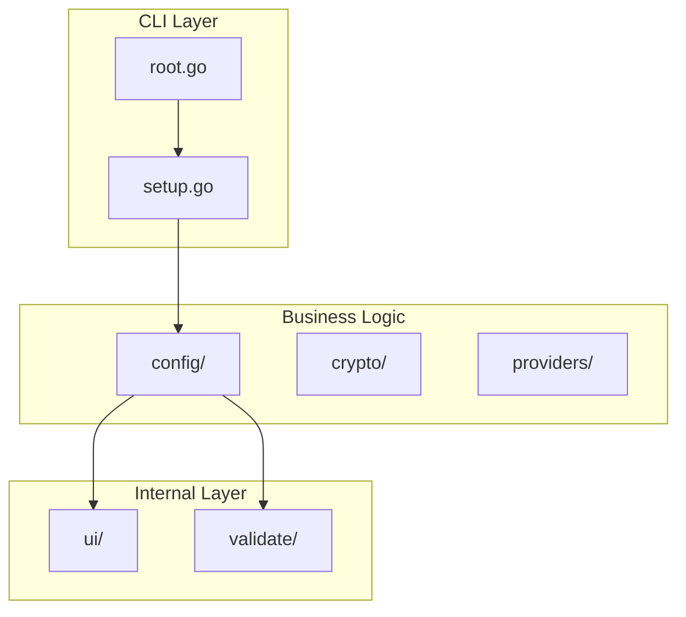
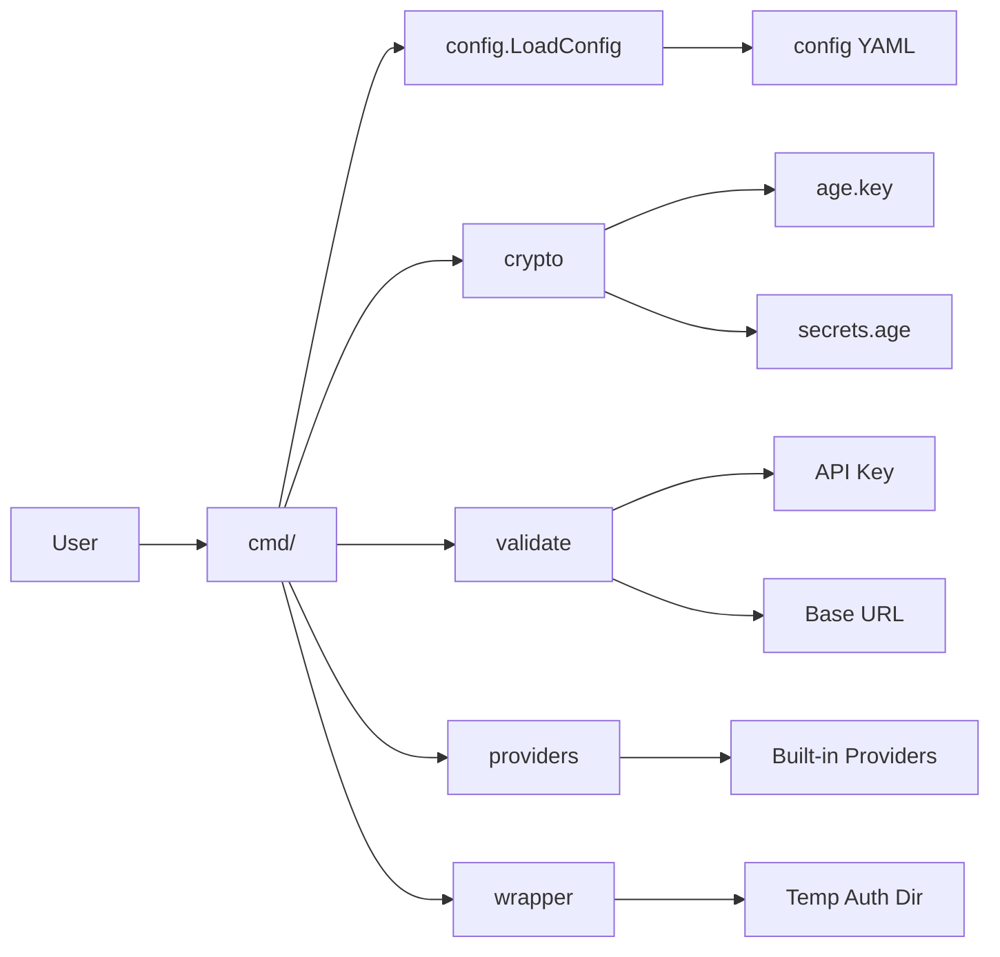

# Internal Packages

Core business logic modules with no CLI dependencies.

## Architecture Overview



## Packages

### config/

Configuration loading and saving with YAML support.

| Function             | Purpose                    |
| -------------------- | -------------------------- |
| `LoadConfig()`       | Load YAML configuration    |
| `SaveConfig()`       | Save YAML configuration    |
| `ParseSecrets()`     | Parse secrets file         |

**Key Types:**

- `Config` - Root configuration with default provider and providers map
- `Provider` - Provider configuration (name, base_url, model, env_vars)

**Configuration Schema:**

```yaml
default_provider: zai
providers:
  zai:
    name: Z.AI
    base_url: https://api.z.ai/api/anthropic
    model: glm-4.7
  anthropic:
    name: Native Anthropic
```

### crypto/

Age (X25519) encryption for secrets management.

| Function                | Purpose                       |
| ----------------------- | ----------------------------- |
| `EnsureKeyExists()`     | Generate key if missing       |
| `EncryptSecrets()`      | Encrypt API keys to file      |
| `DecryptSecrets()`      | Decrypt secrets from file     |

**Security Model:**

- X25519 key pair generated on first run
- Private key stored in `age.key` (0600)
- Secrets encrypted with recipient public key
- All decryption happens in-memory only

**File Structure:**

```text
~/.config/kairo/
├── age.key       # Private key (0600)
└── secrets.age   # Encrypted API keys (0600)
```

### providers/

Built-in provider definitions and registry.

| Function                  | Purpose                         |
| ------------------------- | ------------------------------- |
| `GetBuiltInProvider()`    | Get provider definition         |
| `IsBuiltInProvider()`     | Check if provider exists        |
| `GetProviderList()`       | List all built-in providers     |
| `RequiresAPIKey()`        | Check if API key required       |

**Built-in Providers:**

| Provider    | Base URL                       | Model             | API Key   |
| ----------- | ------------------------------ | ----------------- | --------- |
| anthropic   | -                              | -                 | No        |
| zai         | api.z.ai/api/anthropic         | glm-4.7           | Yes       |
| minimax     | api.minimax.io/anthropic       | MiniMax-M2.5      | Yes       |
| kimi        | api.kimi.com/coding            | kimi-for-coding   | Yes       |
| deepseek    | api.deepseek.com/anthropic     | deepseek-chat     | Yes       |
| custom      | user-defined                   | user-defined      | Yes       |

### Security: Wrapper Scripts

See: [docs/architecture/wrapper-scripts.md](../architecture/wrapper-scripts.md)

**Summary:**

- Secure credential passing via temporary shell scripts
- Token never in process environment (`/proc/<pid>/environ`)
- Private temp directory (0700) + token file (0600)
- Platform-specific (Unix shell, Windows PowerShell)
- Auto-cleanup on exit/interrupt

### validate/

Input validation for API keys, URLs, and provider names.

| Function                        | Purpose                                      |
| ------------------------------- | -------------------------------------------- |
| `ValidateAPIKey()`              | Validate API key format                      |
| `ValidateURL()`                 | Validate HTTPS URL                           |
| `ValidateCustomName()`          | Validate custom provider name                |
| `validateCrossProviderConfig()` | Detect environment variable collisions       |
| `validateProviderModel()`       | Validate model names                         |

**Validation Rules:**

- API key: Minimum 8 characters, no whitespace
- URL: HTTPS required, no localhost/private IPs
- Provider name:
  - Length: 1-50 characters
  - Pattern: `^[a-zA-Z][a-zA-Z0-9_-]*$` (starts with letter)
  - Reserved: Cannot use built-in provider names (case-insensitive)
- Cross-provider validation:
  - Environment variable collisions detection
  - Model name validation (max 100 chars)

### ui/

Terminal UI utilities with colored formatting.

| Function                | Purpose                           |
| ----------------------- | --------------------------------- |
| `PrintHeader()`         | Section header                    |
| `PrintSuccess()`        | Green success message             |
| `PrintWarn()`           | Yellow warning message            |
| `PrintError()`          | Red error message                 |
| `PrintInfo()`           | Gray info message                 |
| `PromptSecret()`        | Password-style input              |
| `PromptWithDefault()`   | Input with default value          |

**Colors:**

- Success: Green
- Warning: Yellow
- Error: Red
- Info: Gray/White
- Header: Cyan

## Testing

```bash
# All internal package tests
go test -race ./internal/...

# Specific package
go test -race ./internal/config/...
go test -race ./internal/crypto/...
go test -race ./internal/providers/...
go test -race ./internal/validate/...

# With coverage
go test -coverprofile=coverage.out ./internal/...
go tool cover -func=coverage.out
```

## Adding a New Provider

1. **Define in `providers/registry.go`:**

```go
var BuiltInProviders = map[string]ProviderDefinition{
    "newprovider": {
        Name:           "New Provider",
        BaseURL:        "https://api.newprovider.com/anthropic",
        Model:          "new-model",
        RequiresAPIKey: true,
        EnvVars:        []string{},
    },
}
```

1. **Add validation (if needed):**
Update `internal/validate/api_key.go` for provider-specific validation.

2. **Test:**

```bash
go test ./internal/providers/...
kairo setup
kairo newprovider "Your query"
```

## Error Handling

Use typed errors from `internal/errors`:

```go
import kairoerrors "github.com/dkmnx/kairo/internal/errors"

// Wrap with context
return kairoerrors.WrapError(kairoerrors.ConfigError,
    "failed to load configuration", err).
    WithContext("path", configPath)

// Create new error
return kairoerrors.NewError(kairoerrors.ValidationError,
    "invalid provider name")
```

**Error Types:**

- `ConfigError` - Configuration loading/saving
- `CryptoError` - Encryption/decryption
- `ValidationError` - Input validation
- `ProviderError` - Provider operations
- `FileSystemError` - File operations
- `NetworkError` - Network operations

## Data Flow



## Dependencies

| Package                          | Purpose                    |
| -------------------------------- | -------------------------- |
| `filippo.io/age`                 | X25519 encryption          |
| `gopkg.in/yaml.v3`               | YAML parsing               |
| `github.com/Masterminds/semver`  | Version comparison         |

## Additional Documentation

- **[Best Practices Guide](../../docs/best-practices.md)** - Production deployment
  and operational best practices for enterprise environments
- **[Troubleshooting Guide](../../docs/troubleshooting/README.md)** - Common issues
  and solutions
- **[Advanced Configuration](../../docs/guides/advanced-configuration.md)** -
  Complex multi-provider scenarios
