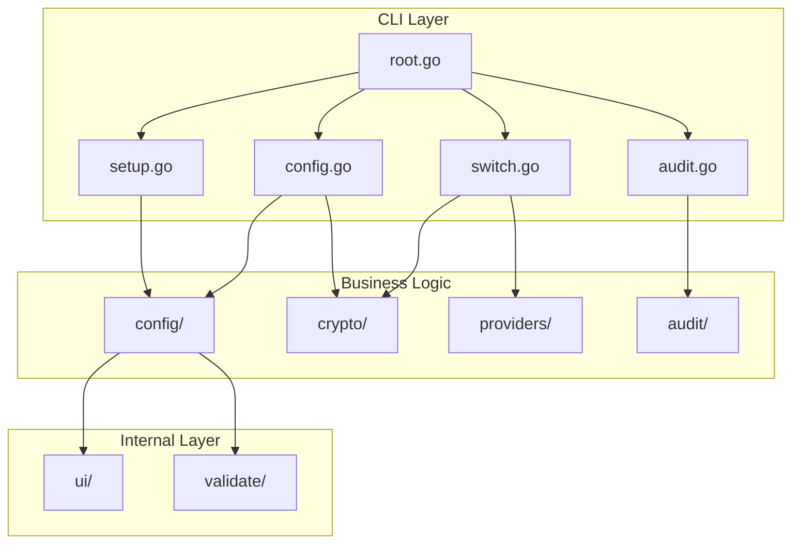
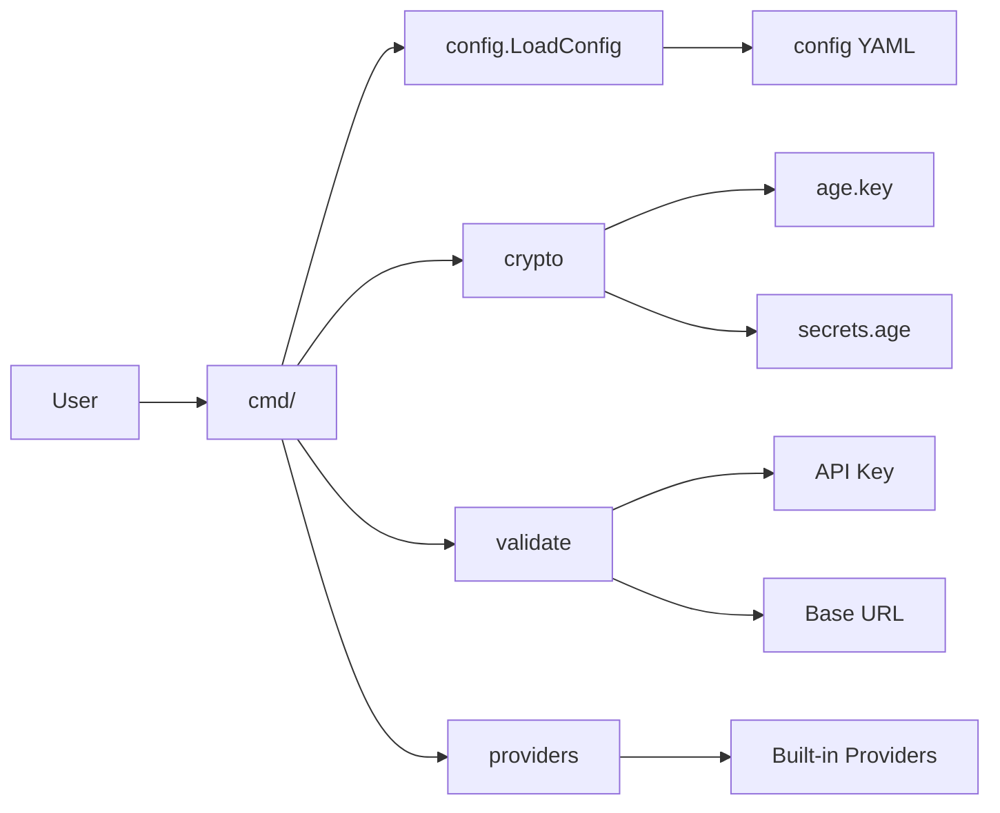

# Internal Packages

Core business logic modules with no CLI dependencies.

## Architecture Overview



## Packages

### audit/

Audit logging for configuration changes.

| Function | Purpose |
|----------|---------|
| `NewLogger()` | Create audit logger |
| `LogConfig()` | Log provider config changes |
| `LogDefault()` | Log default provider changes |
| `LogReset()` | Log provider resets |
| `LogRotate()` | Log key rotations |
| `LogSetup()` | Log provider setup |
| `LogSwitch()` | Log provider switches |
| `ListEntries()` | Read audit entries |
| `ExportCSV()` | Export to CSV format |
| `ExportJSON()` | Export to JSON format |

**Key Types:**
- `AuditEntry` - Individual log entry with timestamp, event, provider, action
- `Change` - Field-level change tracking (field, old, new values)

**See:** [docs/guides/audit-guide.md](../guides/audit-guide.md)

### config/

Configuration loading and saving with YAML support.

| Function | Purpose |
|----------|---------|
| `LoadConfig()` | Load YAML configuration |
| `SaveConfig()` | Save YAML configuration |
| `ParseSecrets()` | Parse secrets file content |

**Key Types:**
- `Config` - Root configuration with default provider and providers map
- `Provider` - Provider configuration (name, base_url, model, env_vars)

**Configuration Schema:**
```yaml
default_provider: zai
providers:
  zai:
    name: Z.AI
    base_url: https://api.z.ai/api/anthropic
    model: glm-4.7
  anthropic:
    name: Native Anthropic
```

### crypto/

Age (X25519) encryption for secrets management.

| Function | Purpose |
|----------|---------|
| `EnsureKeyExists()` | Generate key if missing |
| `EncryptSecrets()` | Encrypt API keys to file |
| `DecryptSecrets()` | Decrypt secrets from file |
| `RotateKey()` | Regenerate key and re-encrypt |

**Security Model:**
- X25519 key pair generated on first run
- Private key stored in `age.key` (0600)
- Secrets encrypted with recipient public key
- All decryption happens in-memory only

**File Structure:**
```
~/.config/kairo/
├── age.key       # Private key (0600)
└── secrets.age   # Encrypted API keys (0600)
```

### providers/

Built-in provider definitions and registry.

| Function | Purpose |
|----------|---------|
| `GetBuiltInProvider()` | Get provider definition |
| `IsBuiltInProvider()` | Check if provider exists |
| `GetProviderList()` | List all built-in providers |
| `RequiresAPIKey()` | Check if API key required |

**Built-in Providers:**

| Provider | Base URL | Model | API Key |
|----------|----------|-------|---------|
| anthropic | - | - | No |
| zai | api.z.ai/api/anthropic | glm-4.7 | Yes |
| minimax | api.minimax.io/anthropic | Minimax-M2.1 | Yes |
| kimi | api.kimi.com/coding | kimi-for-coding | Yes |
| deepseek | api.deepseek.com/anthropic | deepseek-chat | Yes |
| custom | user-defined | user-defined | Yes |

### validate/

Input validation for API keys, URLs, and provider names.

| Function | Purpose |
|----------|---------|
| `ValidateAPIKey()` | Validate API key format |
| `ValidateURL()` | Validate HTTPS URL |
| `ValidateCustomName()` | Validate custom provider name |
| `validateCrossProviderConfig()` | Detect environment variable collisions across providers |
| `validateProviderModel()` | Validate model names against provider capabilities |

**Validation Rules:**
- API key: Minimum 8 characters, no whitespace
- URL: HTTPS required, no localhost/private IPs
- Provider name:
  - Length: 1-50 characters
  - Pattern: `^[a-zA-Z][a-zA-Z0-9_-]*$` (starts with letter, alphanumeric/underscore/hyphen)
  - Reserved: Cannot use built-in provider names (anthropic, zai, minimax, deepseek, kimi, custom) - case-insensitive
- Cross-provider validation:
  - Environment variable collisions: Detects when multiple providers set the same env var with different values
  - Model name validation: For providers with default models, validates model names are reasonable (max 100 chars, valid characters: alphanumeric, hyphen, underscore, dot)

### ui/

Terminal UI utilities with colored formatting.

| Function | Purpose |
|----------|---------|
| `PrintHeader()` | Section header |
| `PrintSuccess()` | Green success message |
| `PrintWarn()` | Yellow warning message |
| `PrintError()` | Red error message |
| `PrintInfo()` | Gray info message |
| `PromptSecret()` | Password-style input |
| `PromptWithDefault()` | Input with default value |

**Colors:**
- Success: Green
- Warning: Yellow
- Error: Red
- Info: Gray/White
- Header: Cyan

## Testing

```bash
# All internal package tests
go test -race ./internal/...

# Specific package
go test -race ./internal/config/...
go test -race ./internal/crypto/...
go test -race ./internal/providers/...
go test -race ./internal/validate/...
go test -race ./internal/audit/...

# With coverage
go test -coverprofile=coverage.out ./internal/...
go tool cover -func=coverage.out
```

## Adding a New Provider

1. **Define in `providers/registry.go`:**
```go
var BuiltInProviders = map[string]ProviderDefinition{
    "newprovider": {
        Name:           "New Provider",
        BaseURL:        "https://api.newprovider.com/anthropic",
        Model:          "new-model",
        RequiresAPIKey: true,
        EnvVars:        []string{},
    },
}
```

2. **Add validation (if needed):**
Update `internal/validate/api_key.go` for provider-specific validation.

3. **Test:**
```bash
go test ./internal/providers/...
kairo config newprovider
kairo test newprovider
```

## Error Handling

Use typed errors from `internal/errors`:

```go
import kairoerrors "github.com/dkmnx/kairo/internal/errors"

// Wrap with context
return kairoerrors.WrapError(kairoerrors.ConfigError,
    "failed to load configuration", err).
    WithContext("path", configPath)

// Create new error
return kairoerrors.NewError(kairoerrors.ValidationError, "invalid provider name")
```

**Error Types:**
- `ConfigError` - Configuration loading/saving
- `CryptoError` - Encryption/decryption
- `ValidationError` - Input validation
- `ProviderError` - Provider operations
- `FileSystemError` - File operations
- `NetworkError` - Network operations

## Data Flow



## Dependencies

| Package | Purpose |
|---------|---------|
| `filipko.io/age` | X25519 encryption |
| `gopkg.in/yaml.v3` | YAML parsing |
| `github.com/Masterminds/semver` | Version comparison |

## Additional Documentation

- **[Best Practices Guide](../docs/best-practices.md)** - Production deployment and operational best practices for enterprise environments
  - Security best practices
  - Configuration management
  - High availability patterns
  - Monitoring and observability
  - Disaster recovery procedures
  - Performance optimization
  - Compliance and governance

- **[Troubleshooting Guide](../docs/troubleshooting/README.md)** - Common issues and solutions
  - Installation issues
  - Configuration issues
  - Provider issues
  - Encryption issues
  - Claude execution issues
  - Advanced troubleshooting scenarios

- **[Advanced Configuration](../docs/guides/advanced-configuration.md)** - Complex multi-provider scenarios
  - Multi-provider setup strategies
  - Custom provider configuration
  - Environment variable integration
  - Configuration management patterns
  - Complex multi-provider scenarios (NEW)
