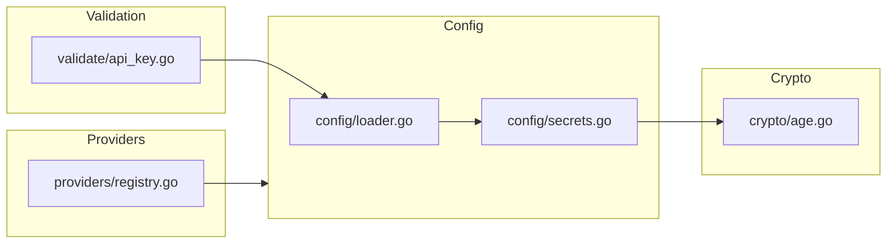

# Internal Packages

Core business logic with no CLI dependencies.

## Packages

### `config/`

Configuration loading and saving with YAML support.

| Function         | Purpose                                             |
| ---------------- | --------------------------------------------------- |
| `LoadConfig()`   | Read and parse config from `~/.config/kairo/config` |
| `SaveConfig()`   | Write config with 0600 permissions                  |
| `ParseSecrets()` | Parse API key environment variables                 |

**Setup:** Standard Go package - no external setup.

**Testing:** `go test ./internal/config/...`

### `crypto/`

Age (X25519) encryption for secrets management.

| Function            | Purpose                           |
| ------------------- | --------------------------------- |
| `GenerateKey()`     | Create new X25519 key pair        |
| `EncryptSecrets()`  | Encrypt API keys to `secrets.age` |
| `DecryptSecrets()`  | Decrypt secrets file              |
| `EnsureKeyExists()` | Auto-generate key on first run    |

**Setup:** Requires `filippo.io/age` dependency.

**Testing:** `go test ./internal/crypto/...`

### `providers/`

Built-in provider definitions and registry.

| Function               | Purpose                         |
| ---------------------- | ------------------------------- |
| `IsBuiltInProvider()`  | Check if provider is built-in   |
| `GetBuiltInProvider()` | Get provider definition         |
| `GetProviderList()`    | List all built-in providers     |
| `RequiresAPIKey()`     | Check if provider needs API key |

**Built-in Providers:**

- `anthropic` - Native Anthropic API (no key required)
- `zai` - Z.AI API
- `minimax` - MiniMax API
- `kimi` - Moonshot AI (Kimi)
- `deepseek` - DeepSeek AI
- `custom` - User-defined provider

**Testing:** `go test ./internal/providers/...`

### `validate/`

Input validation for API keys and URLs.

| Validator          | Rules                                |
| ------------------ | ------------------------------------ |
| `ValidateAPIKey()` | Minimum 8 characters                 |
| `ValidateURL()`    | HTTPS-only, no localhost/private IPs |

**Testing:** `go test ./internal/validate/...`

### `ui/`

Terminal UI utilities and prompts.

**Testing:** `go test ./internal/ui/...`

## Running All Tests

```bash
go test ./internal/...
go test -race ./internal/...
```

## Architecture


