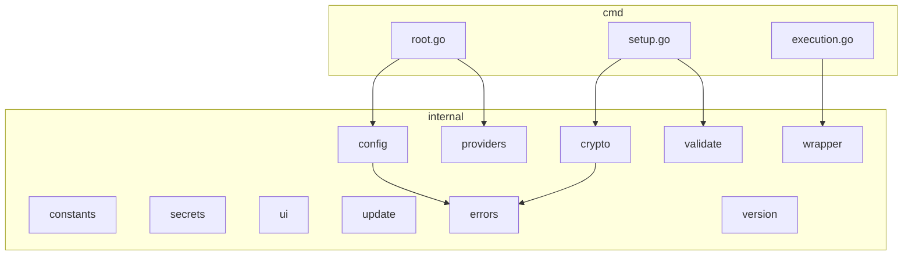
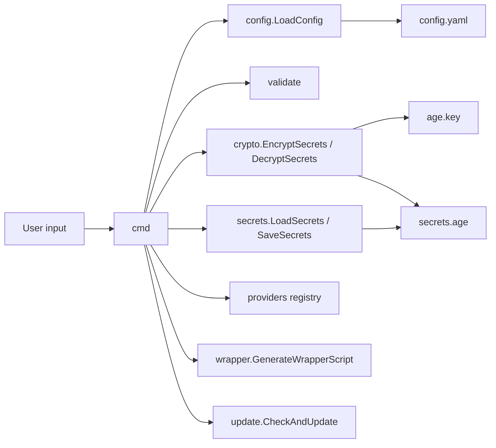

# Internal Packages

Core business logic modules with no direct Cobra command dependencies.

## Architecture Overview


```mermaid
flowchart TB
    subgraph cmd[cmd]
        Root[root.go]
        Setup[setup.go]
        Exec[execution.go]
    end

    subgraph internal[internal]
        Config[config]
        Constants[constants]
        Crypto[crypto]
        Providers[providers]
        Secrets[secrets]
        UI[ui]
        Update[update]
        Validate[validate]
        Wrapper[wrapper]
        Errors[errors]
        Version[version]
    end

    Root --> Config
    Root --> Providers
    Setup --> Crypto
    Setup --> Validate
    Exec --> Wrapper
    Config --> Errors
    Crypto --> Errors
```

## Packages

### `config/`

Configuration loading, caching, migration, and config-directory resolution.

Key types:

- `Config` - root configuration with `default_provider`, `default_harness`, `default_models`, and `providers`
- `Provider` - provider configuration with `name`, `base_url`, `model`, `env_vars`, and `env_key`

Key functions:

- `LoadConfig(ctx, dir)`
- `SaveConfig(ctx, dir, cfg)`
- `ConfigDir()`
- `MigrateConfigOnUpdate(ctx, dir)`

Example schema:

```yaml
default_provider: zai
default_harness: claude
default_models:
  zai: glm-5.1
providers:
  zai:
    name: Z.AI
    base_url: https://api.z.ai/api/anthropic
    model: glm-5.1
    env_key: ZAI_API_KEY
```

### `crypto/`

age/X25519 encryption for secrets management.

Key functions:

- `GenerateKey(ctx, keyPath)`
- `EnsureKeyExists(ctx, configDir)`
- `EncryptSecrets(ctx, secretsPath, keyPath, content)`
- `DecryptSecrets(ctx, secretsPath, keyPath)`
- `DecryptSecretsBytes(ctx, secretsPath, keyPath)`

File layout:

```text
~/.config/kairo/
├── config.yaml
├── age.key
└── secrets.age
```

### `providers/`

Built-in provider definitions and registry helpers.

Key functions:

- `BuiltInProvider(name)`
- `IsBuiltInProvider(name)`
- `ProviderList()`
- `RequiresAPIKey(name)`

Built-in providers:

| Provider                 | Default Base URL                     | Default Model         | API Key |
| :----------------------- | :----------------------------------- | :-------------------- | :------ |
| `zai`                    | `https://api.z.ai/api/anthropic`     | `glm-5.1`             | Yes     |
| `minimax`                | `https://api.minimax.io/anthropic`   | `MiniMax-M2.7`        | Yes     |
| `deepseek`               | `https://api.deepseek.com/anthropic` | `deepseek-v4-pro[1m]` | Yes     |
| `kimi`                   | `https://api.kimi.com/coding/`       | `kimi-for-coding`     | Yes     |
| `anthropic`              | (provider-managed)                   | (provider-managed)    | Yes     |
| `openai`                 | (provider-managed)                   | (provider-managed)    | Yes     |
| `google`                 | (provider-managed)                   | (provider-managed)    | Yes     |
| `mistral`                | (provider-managed)                   | (provider-managed)    | Yes     |
| `groq`                   | (provider-managed)                   | (provider-managed)    | Yes     |
| `cerebras`               | (provider-managed)                   | (provider-managed)    | Yes     |
| `cloudflare-workers-ai`  | (provider-managed)                   | (provider-managed)    | Yes     |
| `xai`                    | (provider-managed)                   | (provider-managed)    | Yes     |
| `openrouter`             | (provider-managed)                   | (provider-managed)    | Yes     |
| `vercel-ai-gateway`      | (provider-managed)                   | (provider-managed)    | Yes     |
| `opencode`               | (provider-managed)                   | (provider-managed)    | Yes     |
| `huggingface`            | (provider-managed)                   | (provider-managed)    | Yes     |
| `fireworks`              | (provider-managed)                   | (provider-managed)    | Yes     |
| `azure-openai-responses` | (provider-managed)                   | (provider-managed)    | Yes     |
| `minimax-cn`             | (provider-managed)                   | (provider-managed)    | Yes     |
| `custom`                 | user-defined                         | user-defined          | Yes     |

### `validate/`

Validation for API keys, URLs, models, and cross-provider env-var conflicts.

Key functions:

- `ValidateAPIKey(key, providerName)`
- `ValidateURL(rawURL, providerName)`
- `ValidateProviderModel(providerName, modelName)`
- `ValidateCrossProviderConfig(cfg)`

Validation rules enforced in code:

- Built-in provider API keys: minimum 32 characters
- Custom/unknown provider API keys: minimum 20 characters
- URLs: HTTPS only, no localhost/private IP targets
- Models: maximum 100 characters, restricted character set
- Cross-provider env vars: conflicting values are rejected

### `wrapper/`

Secure wrapper-script generation for passing credentials to external harness CLIs.

Key functions:

- `CreateTempAuthDir()`
- `WriteTempTokenFile(authDir, token)`
- `GenerateWrapperScript(cfg)`

Behavior:

- Unix: generate executable POSIX shell wrapper
- Windows: generate PowerShell `.ps1` wrapper
- Token file is deleted immediately after the wrapper reads it

See [docs/architecture/wrapper-scripts.md](../docs/architecture/wrapper-scripts.md)

### `ui/`

Terminal output helpers and simple prompt/confirm functions.

Examples:

- `PrintSuccess`, `PrintWarn`, `PrintError`, `PrintInfo`
- `Prompt`, `PromptSecret`, `PromptWithDefault`, `Confirm`
- `PrintBanner(Banner{Version, ModelName, ProviderName, Harness})`

### `errors/`

Typed error construction and contextual wrapping.

Common error types:

- `ConfigError`
- `CryptoError`
- `ValidationError`
- `ProviderError`
- `FileSystemError`
- `NetworkError`
- `RuntimeError`

### `version/`

Build metadata injected at build time.

Variables:

- `Version`
- `Commit`
- `Date`

## Testing

```bash
go test -race ./internal/...
go test ./internal/config/...
go test ./internal/crypto/...
go test ./internal/providers/...
go test ./internal/validate/...
```

## Adding a New Built-in Provider

1. Add the provider to `internal/providers/registry.go`
2. Add it to `providerOrder` in the same file
3. Add provider-specific key validation in `internal/validate/api_key.go` if needed
4. Run provider and validation tests
5. Update docs in `docs/reference/` and `docs/guides/`

## Data Flow


```mermaid
flowchart LR
    User[User input] --> Cmd[cmd]
    Cmd --> Config[config.LoadConfig]
    Cmd --> Validate[validate]
    Cmd --> Crypto[crypto.EncryptSecrets / DecryptSecrets]
    Cmd --> Secrets[secrets.LoadSecrets / SaveSecrets]
    Cmd --> Providers[providers registry]
    Cmd --> Wrapper[wrapper.GenerateWrapperScript]
    Cmd --> Update[update.CheckAndUpdate]
    Config --> YAML[config.yaml]
    Crypto --> Key[age.key]
    Crypto --> SecretsFile[secrets.age]
    Secrets --> SecretsFile
```
